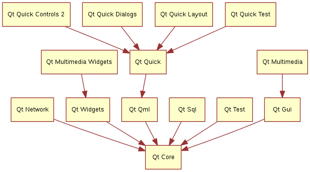

# Qt Building Blocks

Qt 5 consists of a large number of modules. In general, a module is a library for the developer to use. Some modules are mandatory for a Qt-enabled platform and form the set called *Qt Essentials Modules*. Many modules are optional, and form the *Qt Add-On Modules*. The majority of developers may not need to use the latter, but it’s good to know about them as they provide invaluable solutions to common challenges.

## Qt Modules

The Qt Essentials modules are mandatory for any Qt-enabled platform. They offer the foundation to develop modern Qt 5 Applications using Qt Quick 2. The full list of modules is available in the [Qt documentation module list](https://doc.qt.io/qt-5/qtmodules.html).

## Core-Essential Modules

The minimal set of Qt 5 modules to start QML programming.

* **Qt Core** - Core non-graphical classes used by other modules.
* **Qt GUI** - Base classes for graphical user interface (GUI) components. Includes OpenGL.
* **Qt Multimedia** - Classes for audio, video, radio and camera functionality.
* **Qt Multimedia Widgets** - Widget-based classes for implementing multimedia functionality.
* **Qt Network** - Classes to make network programming easier and more portable.
* **Qt QML** - Classes for QML and JavaScript languages.
* **Qt Quick** - A declarative framework for building highly dynamic applications with custom user interfaces.
* **Qt Quick Controls 2** - Provides lightweight QML types for creating performant user interfaces for desktop, embedded, and mobile devices. These types employ a simple styling architecture and are very efficient.
* **Qt Quick Dialogs** - Types for creating and interacting with system dialogs from a Qt Quick application.
* **Qt Quick Layouts** - Layouts are items that are used to arrange Qt Quick 2 based items in the user interface.
* **Qt Quick Test** - A unit test framework for QML applications, where the test cases are written as JavaScript functions.
* **Qt SQL** - Classes for database integration using SQL.
* **Qt Test** - Classes for unit testing Qt applications and libraries.
* **Qt Widgets** - Classes to extend Qt GUI with C++ widgets.

## Qt Add-On Modules

Besides the essential modules, Qt offers additional modules that target specific purposes. Many add-on modules are either feature-complete and exist for backwards compatibility, or are only applicable to certain platforms. Here is a list of some of the available add-on modules, but make sure you familiarize yourself with them all in the [Qt documentation add-ons list](https://doc-snapshots.qt.io/qt5-5.12/qtmodules.html#qt-add-ons) and in the list below.

* Qt 3D - A set of APIs to make 3D graphics programming easy and declarative.
* Qt Bluetooth- C++ and QML APIs for platforms using Bluetooth wireless technology.
* Qt Canvas 3D - Enables OpenGL-like 3D drawing calls from Qt Quick applications using JavaScript.
* Qt Graphical Effects - Graphical effects for use with Qt Quick 2.
* Qt Location - Displays map, navigation, and place content in a QML application.
* Qt Network Authorization - Provides support for OAuth-based authorization to online services.
* Qt Positioning - Provides access to position, satellite and area monitoring classes.
* Qt Purchasing - Enables in-app purchase of products in Qt applications. (Only for Android, iOS and MacOS).
* Qt Sensors - Provides access to sensors and motion gesture recognition.
* Qt Wayland Compositor - Provides a framework to develop a Wayland compositor. (Only for Linux).
* Qt Virtual Keyboard - A framework for implementing different input methods as well as a QML virtual keyboard. Supports localized keyboard layouts and custom visual themes.

::: tip
As these modules are not part of the release, the state of each module may differ depending on how many contributors are active and how well it’s tested.
:::

## Supported Platforms

Qt supports a variety of platforms including all major desktop and embedded platforms. Through the Qt Application Abstraction, it’s now easier than ever to port Qt to your own platform if required.

Testing Qt 5 on a platform is time-consuming. A subset of platforms was selected by the Qt Project to build the reference platforms set. These platforms are thoroughly tested through the system testing to ensure the best quality. However, keep in mind that no code is error-free.

# Qt Project

From the [Qt Project wiki](http://wiki.qt.io/):

> “The Qt Project is a meritocratic consensus-based community interested in Qt. Anyone who shares that interest can join the community, participate in its decision-making processes, and contribute to Qt’s development.”

The Qt Project is an organization which develops the open-source part of the Qt further. It forms the base for other users to contribute. The biggest contributor is The Qt Company, which holds also the commercial rights to Qt.

Qt has an open-source aspect and a commercial aspect for companies. The commercial aspect is for companies which can not or will not comply with the open-source licenses. Without the commercial aspect, these companies would not be able to use Qt and it would not allow The Qt Company to contribute so much code to the Qt Project.

There are many companies worldwide, which make the living out of consultancy and product development using Qt on the various platforms. There are many open-source projects and open-source developers, which rely on Qt as their major development library. It feels good to be part of this vibrant community and to work with this awesome tools and libraries. Does it make you a better person? Maybe:-)

**Contribute here: http://wiki.qt.io/**
