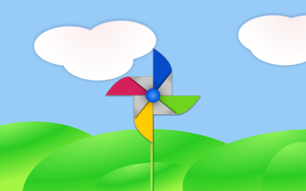
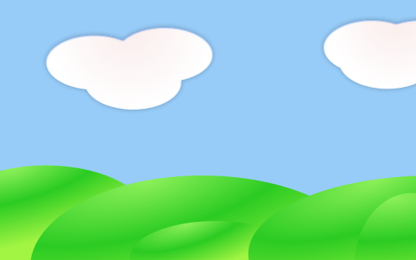
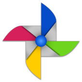

# Qt 5 Introduction

## Qt Quick

Qt Quick is the umbrella term for the user interface technology used in Qt 5. Qt Quick itself is a collection of several technologies:


* QML - Markup language for user interfaces
* JavaScript - The dynamic scripting language
* Qt C++ - The highly portable enhanced c++ library


Similar to HTML, QML is a markup language. It is composed of tags, called types in Qt Quick, that are enclosed in curly brackets: `Item {}`. It was designed from the ground up for the creation of user interfaces, speed and easier reading for developers. The user interface can be enhanced further using JavaScript code. Qt Quick is easily extendable with your own native functionality using Qt C++. In short, the declarative UI is called the front-end and the native parts are called the back-end. This allows you to separate the computing intensive and native operation of your application from the user interface part.

In a typical project, the front-end is developed in QML/JavaScript. The back-end code, which interfaces with the system and does the heavy lifting, is developed using Qt C++. This allows a natural split between the more design-oriented developers and the functional developers. Typically, the back-end is tested using Qt Test, the Qt unit testing framework, and exported for the front-end developers to use.

## Digesting a User Interface

Let’s create a simple user interface using Qt Quick, which showcases some aspects of the QML language. In the end, we will have a paper windmill with rotating blades.



We start with an empty document called `main.qml`. All our QML files will have the suffix `.qml`. As a markup language (like HTML), a QML document needs to have one and only one root type. In our case, this is the `Image` type with a width and height based on the background image geometry:

```qml
import QtQuick 2.12

Image {
    id: root
    source: "images/background.png"
}
```

As QML doesn’t restrict the choice of type for the root type, we use an `Image` type with the source property set to our background image as the root.



::: tip
Each type has properties. For example, an image has the properties `width` and `height`, each holding a count of pixels. It also has other properties, such as `source`. Since the size of the image type is automatically derived from the image size, we don’t need to set the `width` and `height` properties ourselves.
:::

The most standard types are located in the `QtQuick` module, which is made available by the import statement at the start of the `.qml` file.

The `id` is a special and optional property that contains an identifier that can be used to reference its associated type elsewhere in the document. Important: An `id` property cannot be changed after it has been set, and it cannot be set during runtime. Using `root` as the id for the root-type is a convention used in this book to make referencing the top-most type predictable in larger QML documents.

The foreground elements, representing the pole and the pinwheel in the user interface, are included as separate images.




We want to place the pole horizontally in the center of the background, but offset vertically towards the bottom. And we want to place the pinwheel in the middle of the background.

Although this beginners example only uses image types, as we progress you will create more sophisticated user interfaces that are composed of many different types.

```qml
Image {
    id: root
    ...
    Image {
        id: pole
        anchors.horizontalCenter: parent.horizontalCenter
        anchors.bottom: parent.bottom
        source: "images/pole.png"
    }

    Image {
        id: wheel
        anchors.centerIn: parent
        source: "images/pinwheel.png"
    }
    ...
}
```

To place the pinwheel in the middle, we use a complex property called `anchor`. Anchoring allows you to specify geometric relations between parent and sibling objects. For example, place me in the center of another type ( `anchors.centerIn: parent` ). There are left, right, top, bottom, centerIn, fill, verticalCenter and horizontalCenter relations on both ends. Naturally, when two or more anchors are used together, they should complement each other: it wouldn’t make sense, for instance, to anchor a type’s left side to the top of another type.

For the pinwheel, the anchoring only requires one simple anchor.

::: tip
Sometimes you will want to make small adjustments, for example, to nudge a type slightly off-center. This can be done with `anchors.horizontalCenterOffset` or with `anchors.verticalCenterOffset`. Similar adjustment properties are also available for all the other anchors. Refer to the documentation for a full list of anchors properties.
:::

::: tip    
Placing an image as a child type of our root type (the `Image`) illustrates an important concept of a declarative language. You describe the visual appearance of the user interface in the order of layers and grouping, where the topmost layer (our background image) is drawn first and the child layers are drawn on top of it in the local coordinate system of the containing type.
:::

To make the showcase a bit more interesting, let’s make the scene interactive. The idea is to rotate the wheel when the user presses the mouse somewhere in the scene.

We use the `MouseArea` type and make it cover the entire area of our root type.

```qml
Image {
    id: root
    ...
    MouseArea {
        anchors.fill: parent
        onClicked: wheel.rotation += 90
    }
    ...
}
```

The mouse area emits signals when the user clicks inside the area it covers. You can connect to this signal by overriding the `onClicked` function. When a signal is connected, it means that the function (or functions) it corresponds to are called whenever the signal is emitted. In this case, we say that when there’s a mouse click in the mouse area, the type whose `id` is `wheel` (i.e., the pinwheel image) should rotate by +90 degrees.

::: tip
This technique works for every signal, with the naming convention being `on` + `SignalName` in title case. Also, all properties emit a signal when their value changes. For these signals, the naming convention is:
:::

```js
    `on${property}Changed`
```

For example, if a `width` property is changed, you can observe it with `onWidthChanged: print(width)`.

The wheel will now rotate whenever the user clicks, but the rotation takes place in one jump, rather than a fluid movement over time. We can achieve smooth movement using animation. An animation defines how a property change occurs over a period of time. To enable this, we use the `Animation` type’s property called `Behavior`. The `Behavior` specifies an animation for a defined property for every change applied to that property. In other words, whenever the property changes, the animation is run. This is only one of many ways of doing animation in QML.

```qml
Image {
    id: root
    Image {
        id: wheel
        Behavior on rotation {
            NumberAnimation {
                duration: 250
            }
        }
    }
}
```

Now, whenever the wheel’s rotation property changes, it will be animated using a `NumberAnimation` with a duration of 250 ms. So each 90-degree turn will take 250 ms, producing a nice smooth turn.


::: tip
You will not actually see the wheel blurred. This is just to indicate the rotation. (A blurred wheel is in the assets folder, in case you’d like to experiment with it.)
:::

Now the wheel looks much better and behaves nicely, as well as providing a very brief insight into the basics of how Qt Quick programming works.

