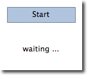
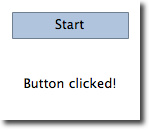

# Components

A component is a reusable element and QML provides different ways to create components. Currently, we will look only at the simplest form - a file-based component. A file-based component is created by placing a QML element in a file and give the file an element name (e.g. `Button.qml`). You can use the component like every other element from the QtQuick module, in our case you would use this in your code as `Button { ... }`.

For example, let’s create a rectangle containing a text component and a mouse area. This resembles a simple button and doesn’t need to be more complicated for our purposes.

```qml
Rectangle { // our inlined button ui
    id: button
    x: 12; y: 12
    width: 116; height: 26
    color: "lightsteelblue"
    border.color: "slategrey"
    Text {
        anchors.centerIn: parent
        text: "Start"
    }
    MouseArea {
        anchors.fill: parent
        onClicked: {
            status.text = "Button clicked!"
        }
    }
}

Text { // text changes when button was clicked
    id: status
    x: 12; y: 76
    width: 116; height: 26
    text: "waiting ..."
    horizontalAlignment: Text.AlignHCenter
}
```

The UI will look similar to this. On the left the UI in the initial state, on the right after the button has been clicked.






Our task is now to extract the button UI in a reusable component. For this, we shortly think about a possible API for our button. You can do this by imagining how someone else should use your button. Here’s what I came up with:

```qml
// minimal API for a button
Button {
    text: "Click Me"
    onClicked: { /* do something */ }
}
```

I would like to set the text using a `text` property and to implement my own click handler. Also, I would expect the button to have a sensible initial size, which I can overwrite (e.g. with `width: 240` for example).

To achieve this we create a `Button.qml` file and copy our button UI inside. Additionally, we need to export the properties a user might want to change on the root level.

```qml
// Button.qml

import QtQuick

Rectangle {
    id: root
    // export button properties
    property alias text: label.text
    signal clicked

    width: 116; height: 26
    color: "lightsteelblue"
    border.color: "slategrey"

    Text {
        id: label
        anchors.centerIn: parent
        text: "Start"
    }
    MouseArea {
        anchors.fill: parent
        onClicked: {
            root.clicked()
        }
    }
}
```

We have exported the text and clicked signal on the root level. Typically we name our root element root to make the referencing easier. We use the `alias` feature of QML, which is a way to export properties inside nested QML elements to the root level and make this available for the outside world. It is important to know, that only the root level properties can be accessed from outside this file by other components.

To use our new `Button` element we can simply declare it in our file. So the earlier example will become a little bit simplified.

```qml
Button { // our Button component
    id: button
    x: 12; y: 12
    text: "Start"
    onClicked: {
        status.text = "Button clicked!"
    }
}

Text { // text changes when button was clicked
    id: status
    x: 12; y: 76
    width: 116; height: 26
    text: "waiting ..."
    horizontalAlignment: Text.AlignHCenter
}
```

Now you can use as many buttons as you like in your UI by just using `Button { ... }`. A real button could be more complex, e.g providing feedback when clicked or showing a nicer decoration.

::: tip
If you want to, you could even go a step further and use an item as a root element. This prevents users to change the color of our designed button and provides us with more control about the exported API. The target should be to export a minimal API. Practically this means we would need to replace the root `Rectangle` with an `Item` and make the rectangle a nested element in the root item.

```qml
Item {
    id: root
    width: 116; height: 26

    property alias text: label.text
    signal clicked

    Rectangle {
        anchors.fill parent
        color: "lightsteelblue"
        border.color: "slategrey"
    }
    ...
}
```
:::

With this technique, it is easy to create a whole series of reusable components.

