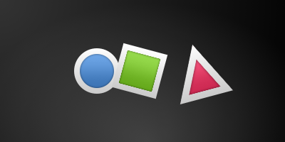

## Simple Transformations

A transformation manipulates the geometry of an object. QML Items can, in general, be translated, rotated and scaled. There is a simple form of these operations and a more advanced way.

Let’s start with the simple transformations. Here is our scene as our starting point.

A simple translation is done via changing the `x,y` position. A rotation is done using the `rotation` property. The value is provided in degrees (0 .. 360). A scaling is done using the `scale` property and a value <1 means the element is scaled down and `>1` means the element is scaled up. Rotation and scaling do not change an item's geometry: the `x,y` and `width/height` haven’t changed; only the painting instructions are transformed.

Before we show off the example I would like to introduce a little helper: the `ClickableImage` element. The `ClickableImage` is just an image with a mouse area. This brings up a useful rule of thumb - if you have copied a chunk of code three times, extract it into a component.

```qml
// ClickableImage.qml
// Simple image which can be clicked

import QtQuick

Image {
    id: root
    signal clicked

    MouseArea {
        anchors.fill: parent
        onClicked: root.clicked()
    }
}
```


We use our clickable image to present three objects (box, circle, triangle). Each object performs a simple transformation when clicked. Clicking the background will reset the scene.

```qml
// transformation.qml

import QtQuick

Item {
    // set width based on given background
    width: bg.width
    height: bg.height

    Image { // nice background image
        id: bg
        source: "assets/background.png"
    }

    MouseArea {
        id: backgroundClicker
        // needs to be before the images as order matters
        // otherwise this mousearea would be before the other elements
        // and consume the mouse events
        anchors.fill: parent
        onClicked: {
            // reset our little scene
            circle.x = 84
            box.rotation = 0
            triangle.rotation = 0
            triangle.scale = 1.0
        }
    }

    ClickableImage {
        id: circle
        x: 84; y: 68
        source: "assets/circle_blue.png"
        antialiasing: true
        onClicked: {
            // increase the x-position on click
            x += 20
        }
    }

    ClickableImage {
        id: box
        x: 164; y: 68
        source: "assets/box_green.png"
        antialiasing: true
        onClicked: {
            // increase the rotation on click
            rotation += 15
        }
    }

    ClickableImage {
        id: triangle
        x: 248; y: 68
        source: "assets/triangle_red.png"
        antialiasing: true
        onClicked: {
            // several transformations
            rotation += 15
            scale += 0.05
        }
    }

    function _test_transformed() {
        circle.x += 20
        box.rotation = 15
        triangle.scale = 1.2
        triangle.rotation = -15
    }

    function _test_overlap() {
        circle.x += 40
        box.rotation = 15
        triangle.scale = 2.0
        triangle.rotation = 45
    }
}
```



The circle increments the x-position on each click and the box will rotate on each click. The triangle will rotate and scale the image up on each click, to demonstrate a combined transformation. For the scaling and rotation operation we set `antialiasing: true` to enable anti-aliasing, which is switched off (same as the clipping property `clip`) for performance reasons.  In your own work, when you see some rasterized edges in your graphics, then you should probably switch smoothing on.

::: tip
To achieve better visual quality when scaling images, it is recommended to scale down instead of up. Scaling an image up with a larger scaling factor will result in scaling artifacts (blurred image). When scaling an image you should consider using \`\` antialiasing: true\`\` to enable the usage of a higher quality filter.
:::

The background `MouseArea` covers the whole background and resets the object values.

::: tip
Elements which appear earlier in the code have a lower stacking order (called z-order). If you click long enough on `circle` you will see it moves below `box`. The z-order can also be manipulated by the `z` property of an Item.


This is because `box` appears later in the code. The same applies also to mouse areas. A mouse area later in the code will overlap (and thus grab the mouse events) of a mouse area earlier in the code.

Please remember: *the order of elements in the document matters*.
:::

