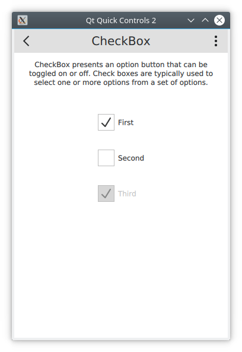
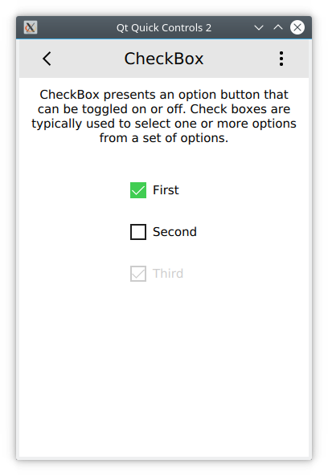
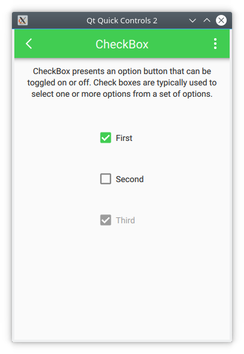
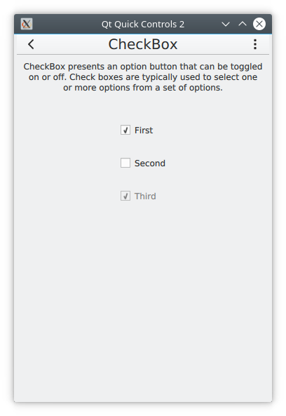

# Introduction to Controls

Using Qt Quick from scratch gives you primitive graphical and interaction elements from which you can build your user interfaces. Using Qt Quick Controls you start from a slightly more structured set of controls to build from. 

The controls range from simple text labels and buttons to more complex ones such as sliders and dials. These element are handy if you want to create a user interface based on classic interaction patterns as they provide a foundation to stand on.

The Qt Quick Controls comes with a number of styles out of the box that are shown in the table below. The *Default* style is a basic flat style. The *Universal* style is based on the Microsoft Universal Design Guidelines, while *Material* is based on Google’s Material Design Guidelines, and the *Fusion* style is a desktop oriented style.

Some of the styles can be tweaked by tweaking the used palette. The *Imagine* is a style based on image assets, this allows a graphical designer to create a new style without writing any code at all, not even for palette colour codes.

* Default
    
    

* Universal
    
    

* Material

    

* Fusion

    

* Imagine

    

* Windows

    

* Mac

    

The Qt Quick Controls 2 is available from the `QtQuick.Controls` import module. In this module you will find the basic controls such as buttons, labels, checkboxes, sliders and so on. In addition to these controls, the following modules are also of interest:

* **`QtQuick.Controls`** - The basic controls.

* **`QtQuick.Templates`** - Provides the non-visual part of the controls.
* **`QtQuick.Controls.Universal`** - Universal style theming support.
* **`QtQuick.Controls.Material`** - Material style theming support.
* **`Qt.labs.platform`** - Support for platform native dialogs for common tasks such as picking files, colours, etc, as well as system tray icons and standard paths.

:::warning Qt.Labs
Notice that the `Qt.labs` modules are experimental, meaning that their APIs can have breaking changes between Qt versions.
:::

