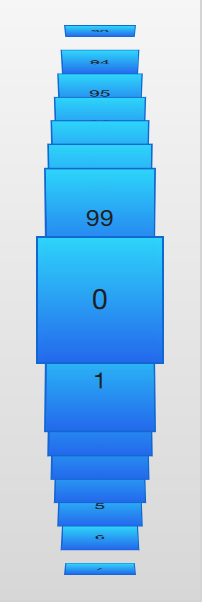
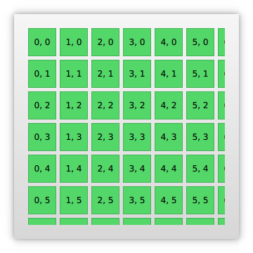
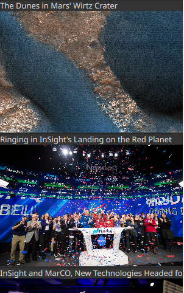
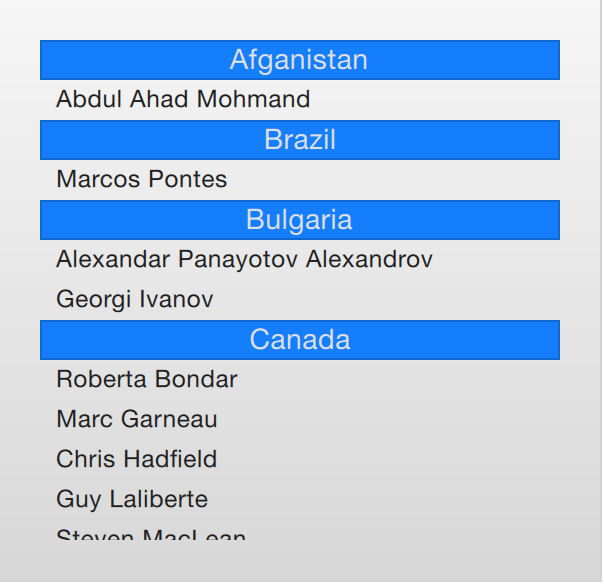
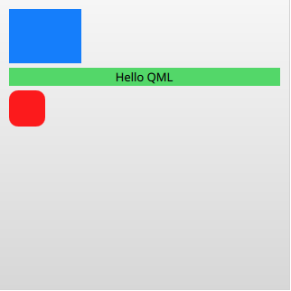

# Advanced Techniques

## The PathView

The `PathView` element is the most powerful, but also the most complex, view provided in Qt Quick. It makes it possible to create a view where the items are laid out along an arbitrary path. Along the same path, attributes such as scale, opacity and more can be controlled in detail.

When using the `PathView`, you have to define a delegate and a path. In addition to this, the `PathView` itself can be customized through a range of properties. The most common being `pathItemCount`, controlling the number of visible items at once, and the highlight range control properties `preferredHighlightBegin`, `preferredHighlightEnd` and `highlightRangeMode`, controlling where along the path the current item is to be shown.

Before looking at the highlight range control properties in depth, we must look at the `path` property. The `path` property expects a `Path` element defining the path that the delegates follow as the `PathView` is being scrolled. The path is defined using the `startX` and `startY` properties in combinations with path elements such as `PathLine`, `PathQuad` and `PathCubic`.  These elements are joined together to form a two-dimensional path.

When the path has been defined, it is possible to further tune it using `PathPercent` and `PathAttribute` elements. These are placed in between path elements and provide more fine-grained control over the path and the delegates on it. The `PathPercent` controls how large a portion of the path that has been covered between each element. This, in turn, controls the distribution of delegates along the path, as they are distributed proportionally to the percentage progressed.

This is where the `preferredHighlightBegin` and `preferredHighlightEnd` properties of the `PathView` enters the picture. They both expect real values in the range between zero and one. The end is also expected to be more or equal to the beginning. Setting both these properties too, for instance, 0.5, the current item will be displayed at the location fifty percent along the path.

In the `Path`, the `PathAttribute` elements are placed between elements, just as `PathPercent` elements. They let you specify property values that are interpolated along the path. These properties are attached to the delegates and can be used to control any conceivable property.




The example below demonstrates how the `PathView` element is used to create a view of cards that the user can flip through. It employs a number of tricks to do this. The path consists of three `PathLine` elements. Using `PathPercent` elements, the central element is properly centered and provided enough space not to be cluttered by other elements. Using `PathAttribute` elements, the rotation, size and `z`-value is controlled.

In addition to the `path`, the `pathItemCount` property of the `PathView` has been set. This controls how densely populated the path will be. The `preferredHighlightBegin` and `preferredHighlightEnd` the `PathView.onPath` is used to control the visibility of the delegates.

```qml
PathView {
    anchors.fill: parent

    delegate: flipCardDelegate
    model: 100

    path: Path {
        startX: root.width/2
        startY: 0

        PathAttribute { name: "itemZ"; value: 0 }
        PathAttribute { name: "itemAngle"; value: -90.0; }
        PathAttribute { name: "itemScale"; value: 0.5; }
        PathLine { x: root.width/2; y: root.height*0.4; }
        PathPercent { value: 0.48; }
        PathLine { x: root.width/2; y: root.height*0.5; }
        PathAttribute { name: "itemAngle"; value: 0.0; }
        PathAttribute { name: "itemScale"; value: 1.0; }
        PathAttribute { name: "itemZ"; value: 100 }
        PathLine { x: root.width/2; y: root.height*0.6; }
        PathPercent { value: 0.52; }
        PathLine { x: root.width/2; y: root.height; }
        PathAttribute { name: "itemAngle"; value: 90.0; }
        PathAttribute { name: "itemScale"; value: 0.5; }
        PathAttribute { name: "itemZ"; value: 0 }
    }

    pathItemCount: 16

    preferredHighlightBegin: 0.5
    preferredHighlightEnd: 0.5
}
```

The delegate, shown below, utilizes the attached properties `itemZ`, `itemAngle` and `itemScale` from the `PathAttribute` elements. It is worth noticing that the attached properties of the delegate only are available from the `wrapper`. Thus, the `rotX` property is defined to be able to access the value from within the `Rotation` element.

Another detail specific to `PathView` worth noticing is the usage of the attached `PathView.onPath` property. It is common practice to bind the visibility to this, as this allows the `PathView` to keep invisible elements for caching purposes. This can usually not be handled through clipping, as the item delegates of a `PathView` are placed more freely than the item delegates of `ListView` or `GridView` views.

```qml
Component {
    id: flipCardDelegate

    BlueBox {
        id: wrapper

        width: 64
        height: 64
        antialiasing: true

        gradient: Gradient {
            GradientStop { position: 0.0; color: "#2ed5fa" }
            GradientStop { position: 1.0; color: "#2467ec" }
        }


        visible: PathView.onPath

        scale: PathView.itemScale
        z: PathView.itemZ

        property variant rotX: PathView.itemAngle
        transform: Rotation {
            axis { x: 1; y: 0; z: 0 }
            angle: wrapper.rotX;
            origin { x: 32; y: 32; }
        }
        text: index
    }
}
```

When transforming images or other complex elements on in `PathView`, a performance optimization trick that is common to use is to bind the `smooth` property of the `Image` element to the attached property `PathView.view.moving`. This means that the images are less pretty while moving but smoothly transformed when stationary. There is no point spending processing power on smooth scaling when the view is in motion, as the user will not be able to see this anyway.

When using the `PathView` and changing the `currentIndex` programatically you might want to control the direction that the path moves in. You can do this using the `movementDirection` property. It can be set to `PathView.Shortest`, which is the default value. This means that the movement can be either direction, depending on which way is the closest way to move to the target value. The direction can instead be restricted by setting `movementDirection` to `PathView.Negative` or `PathView.Positive`.

## Table Models

All views discussed until now present an array of items one way or another. Even the `GridView` expects the model to provide a one dimensional list of items. For two dimensional tables of data you need to use the `TableView` element.

The `TableView` is similar to other views in that it combines a `model` with a `delegate` to form a grid. If given a list oriented model, it displays a single column, making it very similar to the `ListView` element. However, it can also display two-dimensional models that explicitly define both columns and rows.

In the example below, we set up a simple `TableView` with a custom model exposed from C++. At the moment, it is not possible to create table oriented models directly from QML, but in the ‘Qt and C++’ chapter the concept is explained. The running example is shown in the image below.




In this example below, we set the `rowSpacing` and `columnSpacing` to control the horizontal and vertical gaps between delegates. The rest of the properties are set up as for any other type of view.

```qml
TableView {
    id: view
    anchors.fill: parent
    anchors.margins: 20

    rowSpacing: 5
    columnSpacing: 5

    clip: true

    model: tableModel

    delegate: cellDelegate
}
```

The delegate itself can carry an implicit size through the `implicitWidth` and `implicitHeight`. This is what we do in the example below. The actual data contents, i.e. the data returned from the model’s `display` role.

```qml
Component {
    id: cellDelegate

    GreenBox {
        implicitHeight: 40
        implicitWidth: 40

        Text {
            anchors.centerIn: parent
            text: display
        }
    }
}
```

It is possible to provide delegates with different sizes depending on the model contents, e.g.:

```qml
GreenBox {
    implicitHeight: (1+row)*10
    // ...
}
```

Notice that both the width and the height must be greater than zero.

When providing an implicit size from the delegate, the tallest delegate of each row and the widest delegate of each column controls the size. This can create interesting behaviour if the width of items depend on the row, or if the height depends on the column. This is because not all delegates are instantiated at all times, so the width of a column might change as the user scrolls through the table.

To avoid the issues with specifying column widths and row heights using implicit delegate sizes, you can provide functions that calculate these sizes. This is done using the `columnWidthProvider` and `rowHeightProvider` . These functions return the size of the width and row respectively as shown below:

```qml
TableView {
    columnWidthProvider: function (column) { return 10*(column+1); }
    // ...
}
```

If you need to dynamically change the column widths or row heights you must notify the view of this by calling the `forceLayout` method. This will make the view re-calculate the size and position of all cells.

## A Model from XML

As XML is a ubiquitous data format, QML provides the `XmlListModel` element that exposes XML data as a model. The element can fetch XML data locally or remotely and then processes the data using XPath expressions.

The example below demonstrates fetching images from an RSS flow. The `source` property refers to a remote location over HTTP, and the data is automatically downloaded.




When the data has been downloaded, it is processed into model items and roles. The `query` property of the `XmlListModel` is an XPath representing the base query for creating model items. In this example, the path is `/rss/channel/item`, so for every item tag, inside a channel tag, inside an RSS tag, a model item is created.

For every model item, a number of roles are extracted. These are represented by `XmlListModelRole` elements. Each role is given a name, which the delegate can access through an attached property. The actual value of each such property is determined through the `elementName` and (optional) `attributeName` properties for each role. For instance, the `title` property corresponds to the `title` XML element, returning the contents between the `<title>` and `</title>` tags.

The `imageSource` property extracts the value of an attribute of a tag instead of the contents of the tag. In this case, the `url` attribute of the `enclosure` tag is extracted as a string. The `imageSource` property can then be used directly as the `source` for an `Image` element, which loads the image from the given URL.

```qml
import QtQuick 6.2
import QtQml.XmlListModel
import "../common"

Background {
    width: 300
    height: 480

    Component {
        id: imageDelegate

        Box {
            width: listView.width
            height: 220
            color: '#333'

            Column {
                Text {
                    text: title
                    color: '#e0e0e0'
                }
                Image {
                    width: listView.width
                    height: 200
                    fillMode: Image.PreserveAspectCrop
                    source: imageSource
                }
            }
        }
    }

    XmlListModel {
        id: imageModel

        source: "https://www.nasa.gov/rss/dyn/image_of_the_day.rss"
        query: "/rss/channel/item"

        XmlListModelRole { name: "title"; elementName: "title" }
        XmlListModelRole { name: "imageSource"; elementName: "enclosure"; attributeName: "url"; }
    }

    ListView {
        id: listView
        anchors.fill: parent
        model: imageModel
        delegate: imageDelegate
    }
}
```

## Lists with Sections

Sometimes, the data in a list can be divided into sections. It can be as simple as dividing a list of contacts into sections under each letter of the alphabet or music tracks under albums. Using a `ListView` it is possible to divide a flat list into categories, providing more depth to the experience.




In order to use sections, the `section.property` and `section.criteria` must be set up. The `section.property` defines which property to use to divide the contents into sections. Here, it is important to know that the model must be sorted so that each section consists of continuous elements, otherwise, the same property name might appear in multiple locations.

The `section.criteria` can be set to either `ViewSection.FullString` or `ViewSection.FirstCharacter`. The first is the default value and can be used for models that have clear sections, for example, tracks of music albums. The latter takes the first character of a property and means that any property can be used for this. The most common example being the last name of contacts in a phone book.

When the sections have been defined, they can be accessed from each item using the attached properties `ListView.section`, `ListView.previousSection` and `ListView.nextSection`. Using these properties, it is possible to detect the first and last item of a section and act accordingly.

It is also possible to assign a section delegate component to the `section.delegate` property of a `ListView`. This creates a section header delegate which is inserted before any items of a section. The delegate component can access the name of the current section using the attached property `section`.

The example below demonstrates the section concept by showing a list of spacemen sectioned after their nationality. The `nation` is used as the `section.property`. The `section.delegate` component, `sectionDelegate`, shows a heading for each nation, displaying the name of the nation. In each section, the names of the spacemen are shown using the `spaceManDelegate` component.

```qml
import QtQuick 6.2
import "../common"

Background {
    width: 300
    height: 290

    ListView {
        anchors.fill: parent
        anchors.margins: 20

        clip: true

        model: spaceMen

        delegate: spaceManDelegate

        section.property: "nation"
        section.delegate: sectionDelegate
    }

    Component {
        id: spaceManDelegate

        Item {
            width: ListView.view.width
            height: 20
            Text {
                anchors.left: parent.left
                anchors.verticalCenter: parent.verticalCenter
                anchors.leftMargin: 8
                font.pixelSize: 12
                text: name
                color: '#1f1f1f'
            }
        }
    }

    Component {
        id: sectionDelegate

        BlueBox {
            width: ListView.view.width
            height: 20
            text: section
            fontColor: '#e0e0e0'
        }
    }


    ListModel {
        id: spaceMen

        ListElement { name: "Abdul Ahad Mohmand"; nation: "Afganistan"; }
        ListElement { name: "Marcos Pontes"; nation: "Brazil"; }
        ListElement { name: "Alexandar Panayotov Alexandrov"; nation: "Bulgaria"; }
        ListElement { name: "Georgi Ivanov"; nation: "Bulgaria"; }
        ListElement { name: "Roberta Bondar"; nation: "Canada"; }
        ListElement { name: "Marc Garneau"; nation: "Canada"; }
        ListElement { name: "Chris Hadfield"; nation: "Canada"; }
        ListElement { name: "Guy Laliberte"; nation: "Canada"; }
        ListElement { name: "Steven MacLean"; nation: "Canada"; }
        ListElement { name: "Julie Payette"; nation: "Canada"; }
        ListElement { name: "Robert Thirsk"; nation: "Canada"; }
        ListElement { name: "Bjarni Tryggvason"; nation: "Canada"; }
        ListElement { name: "Dafydd Williams"; nation: "Canada"; }
    }
}
```

## The ObjectModel

In some cases you might want to use a list view for a large set of different items. You can solve this using dynamic QML and `Loader`, but another options is to use an `ObjectModel` from the `QtQml.Models` module. The object model is different from other models as it lets you put the actual visual elements side the model. That way, the view does not need any `delegate`.




In the example below we put three `Rectangle` elements into the `ObjectModel`. However, one rectangle has a `Text` element child while the last one has rounded corners. This would have resulted in a table-style model using something like a `ListModel`. It would also have resulted in empty `Text` elements in the model.

```qml
import QtQuick 6.2
import QtQml.Models

Rectangle {
    width: 320
    height: 320
    
    gradient: Gradient {
        GradientStop { position: 0.0; color: "#f6f6f6" }
        GradientStop { position: 1.0; color: "#d7d7d7" }
    }
    
    ObjectModel {
        id: itemModel
        
        Rectangle { height: 60; width: 80; color: "#157efb" }
        Rectangle { height: 20; width: 300; color: "#53d769" 
            Text { anchors.centerIn: parent; color: "black"; text: "Hello QML" }
        }
        Rectangle { height: 40; width: 40; radius: 10; color: "#fc1a1c" }
    }
    
    ListView {
        anchors.fill: parent
        anchors.margins: 10
        spacing: 5
        
        model: itemModel
    }
}
```

Another aspect of the `ObjectModel` is that is can be dynamically populated using the `get`, `insert`, `move`, `remove`, and `clear` methods. This way, the contents of the model can be dynamically generated from various sources and still easily shown in a single view.

## Models with Actions

You can also bind Javasscript functions `ListElement` properties. This means that you can put functions into a model. This is very useful when building menus with actions and similar constructs.

The example below demonstrates this by having a model of cities that greet you in different ways. The `actionModel` is a model of four cities, but the `hello` property is bound to functions. Each function takes an argument `value`, but you can have any number arguments.

In the delegate `actionDelegate`, the `MouseArea` calls the function `hello` as an ordinary function and this results a call to the corresponding `hello` property in the model.

```qml
import QtQuick 6.2

Rectangle {
    width: 120
    height: 300

    gradient: Gradient {
        GradientStop { position: 0.0; color: "#f6f6f6" }
        GradientStop { position: 1.0; color: "#d7d7d7" }
    }
    
    ListModel {
        id: actionModel
        
        ListElement {
            name: "Copenhagen"
            hello: function(value) { console.log(value + ": You clicked Copenhagen!"); }
        }
        ListElement {
            name: "Helsinki"
            hello: function(value) { console.log(value + ": Helsinki here!"); }
        }
        ListElement {
            name: "Oslo"
            hello: function(value) { console.log(value + ": Hei Hei fra Oslo!"); }
        }
        ListElement {
            name: "Stockholm"
            hello: function(value) { console.log(value + ": Stockholm calling!"); }
        }
    }

    ListView {
        anchors.fill: parent
        anchors.margins: 20

        clip: true

        model: actionModel

        delegate: actionDelegate
        spacing: 5

        focus: true
    }

    Component {
        id: actionDelegate

        Rectangle {
            width: ListView.view.width
            height: 40

            color: "#157efb"

            Text {
                anchors.centerIn: parent
                font.pixelSize: 10
                text: name
            }
            
            MouseArea {
                anchors.fill: parent
                onClicked: hello(index);
            }
        }
    }
}
```

## Tuning Performance

The perceived performance of a view of a model depends very much on the time needed to prepare new delegates. For instance, when scrolling downwards through a ListView, delegates are added just outside the view from the bottom and are removed just as they leave sight over the top of the view. This becomes apparent if the `clip` property is set to `false`. If the delegates take too much time to initialize, it will become apparent to the user as soon as the view is scrolled too quickly.

To work around this issue you can tune the margins, in pixels, on the sides of a scrolling view. This is done using the `cacheBuffer` property. In the case described above, vertical scrolling, it will control how many pixels above and below the ListView that will contain prepared delegates. Combining this with asynchronously loading `Image` elements can, for instance, give the images time to load before they are brought into view.

Having more delegates sacrifices memory for a smoother experience and slightly more time to initialize each delegate. This does not solve the problem of complex delegates. Each time a delegate is instantiated, its contents are evaluated and compiled. This takes time, and if it takes too much time, it will lead to a poor scrolling experience. Having many elements in a delegate will also degrade the scrolling performance. It simply costs cycles to move many elements.

To remedy the two latter issues, it is recommended to use `Loader` elements. These can be used to instantiate additional elements when they are needed. For instance, an expanding delegate may use a `Loader` to postpone the instantiation of its detailed view until it is needed. For the same reason, it is good to keep the amount of JavaScript to a minimum in each delegate. It is better to let them call complex pieced of JavaScript that resides outside each delegate. This reduces the time spent compiling JavaScript each time a delegate is created.

::: tip
Be aware that using a `Loader` to postpone initialization does just that - it postpones a performance issue. This means that the scrolling performance will be improved, but the actual contents will still take time to appear.
:::

