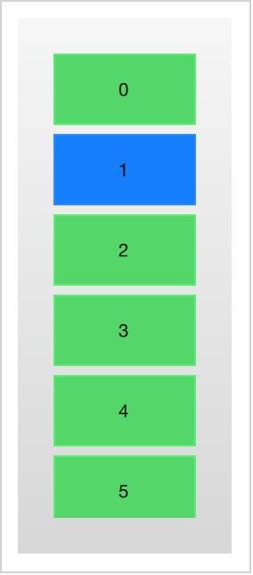
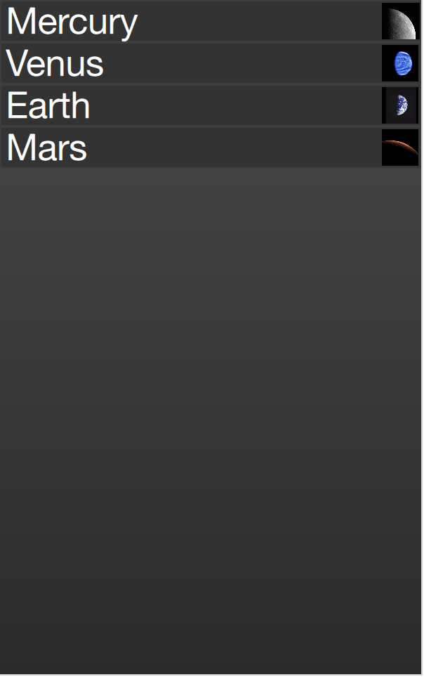
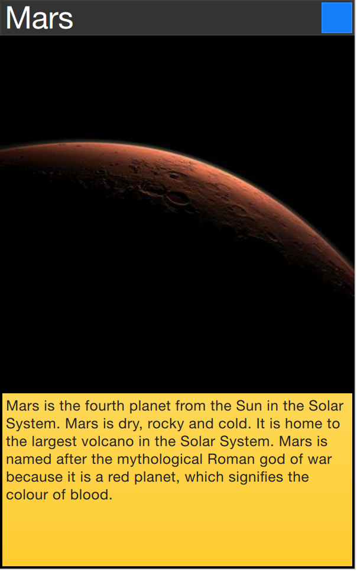

# Delegate

When it comes to using models and views in a custom user interface, the delegate plays a huge role in creating a look. As each item in a model is visualized through a delegate, what is actually visible to the user are the delegates.

Each delegate gets access to a number of attached properties, some from the data model, others from the view. From the model, the properties convey the data for each item to the delegate. From the view, the properties convey state information related to the delegate within the view.

The most commonly used properties attached from the view are `ListView.isCurrentItem` and `ListView.view`. The first is a boolean indicating if the item is the current item, while the latter is a read-only reference to the actual view. Through access to the view, it is possible to create general, reusable delegates that adapt to the size and nature of the view in which they are contained. In the example below, the `width` of each delegate is bound to the `width` of the view, while the background `color` of each delegate depends on the attached `ListView.isCurrentItem` property.

```qml
import QtQuick 2.5

Rectangle {
    width: 120
    height: 300

    gradient: Gradient {
        GradientStop { position: 0.0; color: "#f6f6f6" }
        GradientStop { position: 1.0; color: "#d7d7d7" }
    }

    ListView {
        anchors.fill: parent
        anchors.margins: 20

        clip: true

        model: 100

        delegate: numberDelegate
        spacing: 5

        focus: true
    }

    Component {
        id: numberDelegate

        Rectangle {
            width: ListView.view.width
            height: 40

            color: ListView.isCurrentItem?"#157efb":"#53d769"
            border.color: Qt.lighter(color, 1.1)

            Text {
                anchors.centerIn: parent

                font.pixelSize: 10

                text: index
            }
        }
    }
}
```




If each item in the model is associated with an action, for instance, clicking an item acts upon it, that functionality is a part of each delegate. This divides the event management between the view, which handles the navigation between items in the view, and the delegate which handles actions on a specific item.

The most basic way to do this is to create a `MouseArea` within each delegate and act on the `onClicked` signal. This is demonstrated in the example in the next section of this chapter.

## Animating Added and Removed Items

In some cases, the contents shown in a view changes over time. Items are added and removed as the underlying data model is altered. In these cases, it is often a good idea to employ visual cues to give the user a sense of direction and to help the user understand what data is added or removed.

Conveniently enough, QML views attach two signals, `onAdd` and `onRemove`, to each item delegate. By connecting animations to these, it is easy to create the movement necessary to aid the user in identifying what is taking place.

The example below demonstrates this through the use of a dynamically populated `ListModel`. At the bottom of the screen, a button for adding new items is shown. When it is clicked, a new item is added to the model using the `append` method. This triggers the creation of a new delegate in the view, and the emission of the `GridView.onAdd` signal. The `SequentialAnimation` attached to the signal causes the item to zoom into view by animating the `scale` property of the delegate.

When a delegate in the view is clicked, the item is removed from the model through a call to the `remove` method. This causes the `GridView.onRemove` signal to be emitted, triggering another `SequentialAnimation`. This time, however, the destruction of the delegate must be delayed until the animation has completed. To do this, `PropertyAction` element is used to set the `GridView.delayRemove` property to `true` before the animation, and `false` after. This ensures that the animation is allowed to complete before the delegate item is removed.

```qml
import QtQuick 2.5

Rectangle {
    width: 480
    height: 300

    gradient: Gradient {
        GradientStop { position: 0.0; color: "#dbddde" }
        GradientStop { position: 1.0; color: "#5fc9f8" }
    }

    ListModel {
        id: theModel

        ListElement { number: 0 }
        ListElement { number: 1 }
        ListElement { number: 2 }
        ListElement { number: 3 }
        ListElement { number: 4 }
        ListElement { number: 5 }
        ListElement { number: 6 }
        ListElement { number: 7 }
        ListElement { number: 8 }
        ListElement { number: 9 }
    }

    Rectangle {
        anchors.left: parent.left
        anchors.right: parent.right
        anchors.bottom: parent.bottom
        anchors.margins: 20

        height: 40

        color: "#53d769"
        border.color: Qt.lighter(color, 1.1)

        Text {
            anchors.centerIn: parent

            text: "Add item!"
        }

        MouseArea {
            anchors.fill: parent

            onClicked: {
                theModel.append({"number": ++parent.count});
            }
        }

        property int count: 9
    }

    GridView {
        anchors.fill: parent
        anchors.margins: 20
        anchors.bottomMargin: 80

        clip: true

        model: theModel

        cellWidth: 45
        cellHeight: 45

        delegate: numberDelegate
    }

    Component {
        id: numberDelegate

        Rectangle {
            id: wrapper

            width: 40
            height: 40

            gradient: Gradient {
                GradientStop { position: 0.0; color: "#f8306a" }
                GradientStop { position: 1.0; color: "#fb5b40" }
            }

            Text {
                anchors.centerIn: parent

                font.pixelSize: 10

                text: number
            }

            MouseArea {
                anchors.fill: parent

                onClicked: {
                    theModel.remove(index);
                }
            }

            GridView.onRemove: SequentialAnimation {
                PropertyAction { target: wrapper; property: "GridView.delayRemove"; value: true }
                NumberAnimation { target: wrapper; property: "scale"; to: 0; duration: 250; easing.type: Easing.InOutQuad }
                PropertyAction { target: wrapper; property: "GridView.delayRemove"; value: false }
            }

            GridView.onAdd: SequentialAnimation {
                NumberAnimation { target: wrapper; property: "scale"; from: 0; to: 1; duration: 250; easing.type: Easing.InOutQuad }
            }
        }
    }
}
```

## Shape-Shifting Delegates

A commonly used mechanism in lists is that the current item is expanded when activated. This can be used to dynamically let the item expand to fill the screen to enter a new part of the user interface, or it can be used to provide slightly more information for the current item in a given list.

In the example below, each item is expanded to the full extent of the `ListView` containing it when clicked. The extra space is then used to add more information. The mechanism used to control this is a state `expanded` that each item delegate can enter, where the item is expanded. In that state, a number of properties are altered.

First of all, the `height` of the `wrapper` is set to the height of the `ListView`. The thumbnail image is then enlarged and moved down to make it move from its small position into its larger position. In addition to this, the two hidden items, the `factsView` and `closeButton` are shown by altering the `opacity` of the elements. Finally, the `ListView` is setup.

Setting up the `ListView` involves setting the `contentsY`, that is the top of the visible part of the view, to the `y` value of the delegate. The other change is to set `interactive` of the view to `false`. This prevents the view from moving. The user can no longer scroll through the list or change the current item.

As the item first is clicked, it enters the `expanded` state, causing the item delegate to fill the `ListView` and the contents to rearrange. When the close button is clicked, the state is cleared, causing the delegate to return to its previous state and re-enabling the `ListView`.

```qml
import QtQuick 2.5

Item {
    width: 300
    height: 480

    Rectangle {
        anchors.fill: parent
        gradient: Gradient {
            GradientStop { position: 0.0; color: "#4a4a4a" }
            GradientStop { position: 1.0; color: "#2b2b2b" }
        }
    }

    ListView {
        id: listView

        anchors.fill: parent

        delegate: detailsDelegate
        model: planets
    }

    ListModel {
        id: planets

        ListElement { name: "Mercury"; imageSource: "images/mercury.jpeg"; facts: "Mercury is the smallest planet in the Solar System. It is the closest planet to the sun. It makes one trip around the Sun once every 87.969 days." }
        ListElement { name: "Venus"; imageSource: "images/venus.jpeg"; facts: "Venus is the second planet from the Sun. It is a terrestrial planet because it has a solid, rocky surface. The other terrestrial planets are Mercury, Earth and Mars. Astronomers have known Venus for thousands of years." }
        ListElement { name: "Earth"; imageSource: "images/earth.jpeg"; facts: "The Earth is the third planet from the Sun. It is one of the four terrestrial planets in our Solar System. This means most of its mass is solid. The other three are Mercury, Venus and Mars. The Earth is also called the Blue Planet, 'Planet Earth', and 'Terra'." }
        ListElement { name: "Mars"; imageSource: "images/mars.jpeg"; facts: "Mars is the fourth planet from the Sun in the Solar System. Mars is dry, rocky and cold. It is home to the largest volcano in the Solar System. Mars is named after the mythological Roman god of war because it is a red planet, which signifies the colour of blood." }
    }

    Component {
        id: detailsDelegate

        Item {
            id: wrapper

            width: listView.width
            height: 30

            Rectangle {
                anchors.left: parent.left
                anchors.right: parent.right
                anchors.top: parent.top

                height: 30

                color: "#333"
                border.color: Qt.lighter(color, 1.2)
                Text {
                    anchors.left: parent.left
                    anchors.verticalCenter: parent.verticalCenter
                    anchors.leftMargin: 4

                    font.pixelSize: parent.height-4
                    color: '#fff'

                    text: name
                }
            }


            Rectangle {
                id: image

                width: 26
                height: 26

                anchors.right: parent.right
                anchors.top: parent.top
                anchors.rightMargin: 2
                anchors.topMargin: 2

                color: "black"


                Image {
                    anchors.fill: parent

                    fillMode: Image.PreserveAspectFit

                    source: imageSource
                }
            }

            MouseArea {
                anchors.fill: parent
                onClicked: parent.state = "expanded"
            }

            Item {
                id: factsView

                anchors.top: image.bottom
                anchors.left: parent.left
                anchors.right: parent.right
                anchors.bottom: parent.bottom

                opacity: 0

                Rectangle {
                    anchors.fill: parent

                    gradient: Gradient {
                        GradientStop { position: 0.0; color: "#fed958" }
                        GradientStop { position: 1.0; color: "#fecc2f" }
                    }
                    border.color: '#000000'
                    border.width: 2

                    Text {
                        anchors.fill: parent
                        anchors.margins: 5

                        clip: true
                        wrapMode: Text.WordWrap
                        color: '#1f1f21'

                        font.pixelSize: 12

                        text: facts
                    }
                }
            }

            Rectangle {
                id: closeButton

                anchors.right: parent.right
                anchors.top: parent.top
                anchors.rightMargin: 2
                anchors.topMargin: 2

                width: 26
                height: 26

                color: "#157efb"
                border.color: Qt.lighter(color, 1.1)

                opacity: 0

                MouseArea {
                    anchors.fill: parent
                    onClicked: wrapper.state = ""
                }
            }

            states: [
                State {
                    name: "expanded"

                    PropertyChanges { target: wrapper; height: listView.height }
                    PropertyChanges { target: image; width: listView.width; height: listView.width; anchors.rightMargin: 0; anchors.topMargin: 30 }
                    PropertyChanges { target: factsView; opacity: 1 }
                    PropertyChanges { target: closeButton; opacity: 1 }
                    PropertyChanges { target: wrapper.ListView.view; contentY: wrapper.y; interactive: false }
                }
            ]

            transitions: [
                Transition {
                    NumberAnimation {
                        duration: 200;
                        properties: "height,width,anchors.rightMargin,anchors.topMargin,opacity,contentY"
                    }
                }
            ]
        }
    }
}
```







The techniques demonstrated here to expand the delegate to fill the entire view can be employed to make an item delegate shift shape in a much smaller way. For instance, when browsing through a list of songs, the current item could be made slightly larger, accommodating more information about that particular item.

