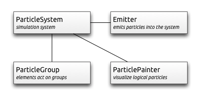

# Concept

In the heart of the particle simulation is the `ParticleSystem` which controls the shared timeline. A scene can have several particles systems, each of them with an independent time-line. A particle is emitted using an `Emitter` element and visualized with a `ParticlePainter`, which can be an image, QML item or a shader item.
An emitter provides also the direction for particle using a vector space. Particle ones emitted can’t be manipulated by the emitter anymore. The particle module provides the `Affector`, which allows manipulating parameters of the particle after it has been emitted.

Particles in a system can share timed transitions using the `ParticleGroup` element. By default, every particle is on the empty (‘’) group.

* `ParticleSystem` - manages shared time-line between emitters

* `Emitter` - emits logical particles into the system

* `ParticlePainter` - particles are visualized by a particle painter

* `Direction` - vector space for emitted particles

* `ParticleGroup` - every particle is a member of a group

* `Affector` - manipulates particles after they have been emitted

