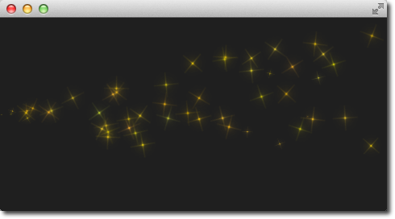
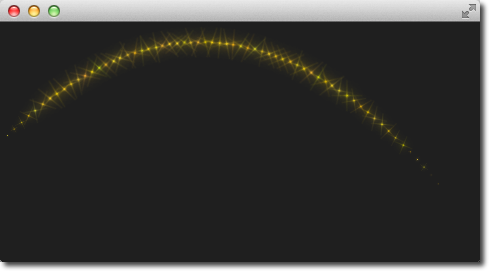
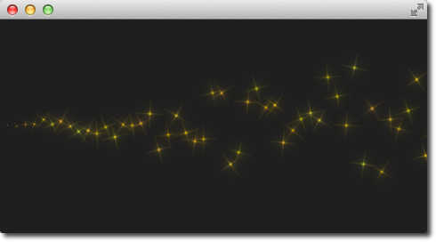
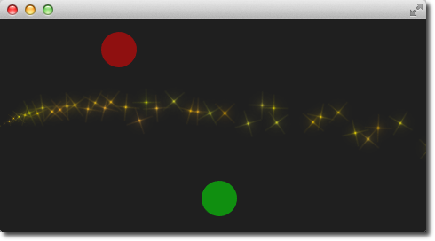

# Directed Particles

We have seen particles can rotate. But particles can also have a trajectory. The trajectory is specified as the velocity or acceleration of particles defined by a stochastic direction also named a vector space.

There are different vector spaces available to define the velocity or acceleration of a particle:


* `AngleDirection` - a direction that varies in angle


* `PointDirection` - a direction that varies in x and y components


* `TargetDirection` - a direction towards the target point


Let’s try to move the particles over from the left to the right side of our scene by using the velocity directions.

We first try the `AngleDirection`. For this we need to specify the `AngleDirection` as an element of the velocity property of our emitter:

```qml
velocity: AngleDirection { }
```

The angle where the particles are emitted is specified using the angle property. The angle is provided as a value between 0..360 degree and 0 points to the right. For our example, we would like the particles to move to the right so 0 is already the right direction. The particles shall spread by +/- 5 degrees:

```qml
velocity: AngleDirection {
    angle: 0
    angleVariation: 15
}
```

Now we have set our direction, the next thing is to specify the velocity of the particle. This is defined by a magnitude. The magnitude is defined in pixels per seconds. As we have ca. 640px to travel 100 seems to be a good number. This would mean by an average lifetime of 6.4 secs a particle would cross the open space. To make the traveling of the particles more interesting we vary the magnitude using the `magnitudeVariation` and set this to the half of the magnitude:

```qml
velocity: AngleDirection {
    ...
    magnitude: 100
    magnitudeVariation: 50
}
```




Here is the full source code, with an average lifetime set to 6.4 seconds. We set the emitter width and height to 1px. This means all particles are emitted at the same location and from thereon travel based on our given trajectory.

```qml
Emitter {
    id: emitter
    anchors.left: parent.left
    anchors.verticalCenter: parent.verticalCenter
    width: 1; height: 1
    system: particleSystem
    lifeSpan: 6400
    lifeSpanVariation: 400
    size: 32
    velocity: AngleDirection {
        angle: 0
        angleVariation: 15
        magnitude: 100
        magnitudeVariation: 50
    }
}
```

So what is then the acceleration doing? The acceleration adds an acceleration vector to each particle, which changes the velocity vector over time. For example, let’s make a trajectory like an arc of stars. For this we change our velocity direction to -45 degree and remove the variations, to better visualize a coherent arc:

```qml
velocity: AngleDirection {
    angle: -45
    magnitude: 100
}
```

The acceleration direction shall be 90 degrees (down direction) and we choose one-fourth of the velocity magnitude for this:

```qml
acceleration: AngleDirection {
    angle: 90
    magnitude: 25
}
```

The result is an arc going from the center-left to the bottom right.




The values are discovered by try-and-error.

Here is the full code of our emitter.

```qml
Emitter {
    id: emitter
    anchors.left: parent.left
    anchors.verticalCenter: parent.verticalCenter
    width: 1; height: 1
    system: particleSystem
    emitRate: 10
    lifeSpan: 6400
    lifeSpanVariation: 400
    size: 32
    velocity: AngleDirection {
        angle: -45
        angleVariation: 0
        magnitude: 100
    }
    acceleration: AngleDirection {
        angle: 90
        magnitude: 25
    }
}
```

In the next example we would like that the particles again travel from left to right but this time we use the `PointDirection` vector space.

A `PointDirection` derived its vector space from an x and y component. For example, if you want the particles to travel in a 45-degree vector, you need to specify the same value for x and y.

In our case we want the particles to travel from left-to-right building a 15-degree cone. For this we specify a `PointDirection` as our velocity vector space:

```qml
velocity: PointDirection { }
```

To achieve a traveling velocity of 100 px per seconds we set our x component to 100. For the 15 degrees (which is 1/6th of 90 degrees) we specify an y variation of 100/6:

```qml
velocity: PointDirection {
    x: 100
    y: 0
    xVariation: 0
    yVariation: 100/6
}
```

The result should be particles traveling in a 15-degree cone from right to left.




Now coming to our last contender, the `TargetDirection`. The target direction allows us to specify a target point as an x and y coordinate relative to the emitter or an item. When an item has specified the center of the item will become the target point. You can achieve the 15-degree cone by specifying a target variation of 1/6 th of the x target:

```qml
velocity: TargetDirection {
    targetX: 100
    targetY: 0
    targetVariation: 100/6
    magnitude: 100
}
```

::: tip
Target direction are great to use when you have a specific x/y coordinate you want the stream of particles emitted towards.
:::

I spare you the image as it looks the same as the previous one, instead, I have a quest for you.

In the following image, the red and the green circle specify each a target item for the target direction of the velocity respective the acceleration property. Each target direction has the same parameters. Here the question: Who is responsible for velocity and who is for acceleration?




