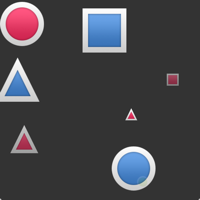

# Particle Painters

Till now we have only used the image based particle painter to visualize particles. Qt comes also with other particle painters:


* `ItemParticle`: delegate based particle painter


* `CustomParticle`: shader based particle painter

The ItemParticle can be used to emit QML items as particles. For this, you need to specify your own delegate to the particle.

```qml
    ItemParticle {
        id: particle
        system: particleSystem
        delegate: itemDelegate
    }
```

Our delegate, in this case, is a random image (using *Math.random()*), visualized with a white border and a random size.

```qml
    Component {
        id: itemDelegate
        Item {
            id: container
            width: 32*Math.ceil(Math.random()*3); height: width
            Image {
                anchors.fill: parent
                anchors.margins: 4
                source: 'assets/'+images[Math.floor(Math.random()*9)]
            }
        }
    }
```

We emit 4 images per second with a lifespan of 4 seconds each. The particles fade automatically in and out.




For more dynamic cases it is also possible to create an item on your own and let the particle take control of it with `take(item, priority)`. By this, the particle simulation takes control of your particle and handles the item like an ordinary particle. You can get back control of the item by using `give(item)`. You can influence item particles even more by halt their life progression using `freeze(item)` and resume their life using `unfreeze(item)`.

