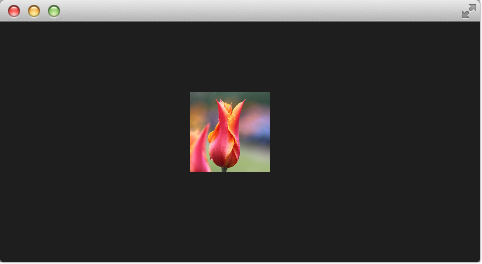
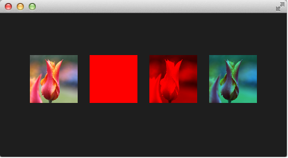

# Fragment Shaders

The fragment shader is called for every pixel to be rendered. We will develop a small red lens, which will increase the red color channel value of the image.

## Setting up the scene

First, we set up our scene, with a grid centered in the field and our source image be displayed.

```qml
import QtQuick 2.5

Rectangle {
    width: 480; height: 240
    color: '#1e1e1e'

    Grid {
        anchors.centerIn: parent
        spacing: 20
        rows: 2; columns: 4
        Image {
            id: sourceImage
            width: 80; height: width
            source: 'assets/tulips.jpg'
        }
    }
}
```




## A red shader

Next, we will add a shader, which displays a red rectangle by providing for each fragment a red color value.

```qml
fragmentShader: "
    uniform lowp float qt_Opacity;
    void main() {
        gl_FragColor = vec4(1.0, 0.0, 0.0, 1.0) * qt_Opacity;
    }
"
```

In the fragment shader we simply assign a *vec4(1.0, 0.0, 0.0, 1.0)* which represents a red color with full opacity (alpha=1.0) to the *gl_FragColor* for each fragment.


## A red shader with texture

Now we want to apply the red color to each texture pixel. For this, we need the texture back in the vertex shader. As we don’t do anything else in the vertex shader the default vertex shader is enough for us.

```qml
ShaderEffect {
    id: effect2
    width: 80; height: width
    property variant source: sourceImage
    visible: root.step>1
    fragmentShader: "
        varying highp vec2 qt_TexCoord0;
        uniform sampler2D source;
        uniform lowp float qt_Opacity;
        void main() {
            gl_FragColor = texture2D(source, qt_TexCoord0) * vec4(1.0, 0.0, 0.0, 1.0) * qt_Opacity;
        }
    "
}
```

The full shader contains now back our image source as variant property and we have left out the vertex shader, which if not specified is the default vertex shader.

In the fragment shader, we pick the texture fragment *texture2D(source, qt_TexCoord0)* and apply the red color to it.


## The red channel property

It’s not really nice to hard code the red channel value, so we would like to control the value from the QML side. For this we add a *redChannel* property to our shader effect and also declare a *uniform lowp float redChannel* inside our fragment shader. That’s all to make a value from the shader code available to the QML side. Very simple.

```qml
ShaderEffect {
    id: effect3
    width: 80; height: width
    property variant source: sourceImage
    property real redChannel: 0.3
    visible: root.step>2
    fragmentShader: "
        varying highp vec2 qt_TexCoord0;
        uniform sampler2D source;
        uniform lowp float qt_Opacity;
        uniform lowp float redChannel;
        void main() {
            gl_FragColor = texture2D(source, qt_TexCoord0) * vec4(redChannel, 1.0, 1.0, 1.0) * qt_Opacity;
        }
    "
}
```

To make the lens really a lens, we change the *vec4* color to be *vec4(redChannel, 1.0, 1.0, 1.0)* so that the other colors are multiplied by 1.0 and only the red portion is multiplied by our *redChannel* variable.




## The red channel animated

As the *redChannel* property is just a normal property it can also be animated as all properties in QML. So we can use QML properties to animate values on the GPU to influence our shaders. How cool is that!

```qml
ShaderEffect {
    id: effect4
    width: 80; height: width
    property variant source: sourceImage
    property real redChannel: 0.3
    visible: root.step>3
    NumberAnimation on redChannel {
        from: 0.0; to: 1.0; loops: Animation.Infinite; duration: 4000
    }

    fragmentShader: "
        varying highp vec2 qt_TexCoord0;
        uniform sampler2D source;
        uniform lowp float qt_Opacity;
        uniform lowp float redChannel;
        void main() {
            gl_FragColor = texture2D(source, qt_TexCoord0) * vec4(redChannel, 1.0, 1.0, 1.0) * qt_Opacity;
        }
    "
}
```

Here the final result.


The shader effect on the 2nd row is animated from 0.0 to 1.0 with a duration of 4 seconds. So the image goes from no red information (0.0 red) over to a normal image (1.0 red).

