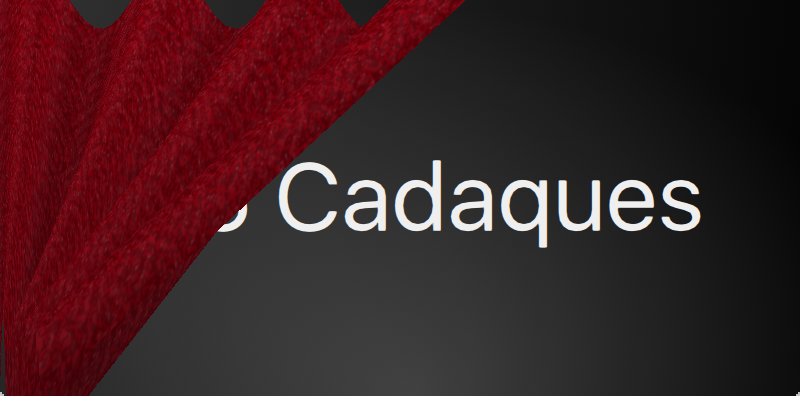
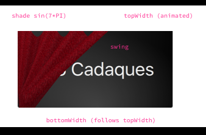

# Curtain Effect

In the last example for custom shader effects, I would like to bring you the curtain effect. This effect was published first in May 2011 as part of [Qt labs for shader effects](http://labs.qt.nokia.com/2011/05/03/qml-shadereffectitem-on-qgraphicsview/).




At that time I really loved these effects and the curtain effect was my favorite out of them. I just love how the curtain opens and hide the background object.

I took the code and adapted it towards Qt 5, which was straightforward. Also, I did some simplifications to be able to use it better for a showcase. So if you are interested in the full example, please visit the lab’s blog.

Just a little bot for the background, the curtain is actually an image called *fabric.jpg* and it is the source for a shader effect. The effect uses the vertex shader to swing the curtain and uses the fragment shader to provide some shades. Here is a simple diagram to make you hopefully better understand the code.




The waved shades of the curtain are computed through a sin curve with 7 up/downs (7\*PI=21.99…) on the width of the curtain. The other important part is the swing. The *topWidth* of the curtain is animated when the curtain is opened or closed. The *bottomWidth* follows the *topWidth* with a *SpringAnimation*. By this, we create the effect of the swinging bottom part of the curtain. The calculated *swing* provides the strength of this swing interpolated over the y-component of the vertexes.

The curtain effect is located in the `CurtainEffect.qml` component where the fabric image act as the texture source. There is nothing new on the use of shaders here, only a different way to manipulate the *gl_Position* in the vertex shader and the *gl_FragColor* in the fragment shader.

```qml
import QtQuick 2.5

ShaderEffect {
    anchors.fill: parent

    mesh: GridMesh {
        resolution: Qt.size(50, 50)
    }

    property real topWidth: open?width:20
    property real bottomWidth: topWidth
    property real amplitude: 0.1
    property bool open: false
    property variant source: effectSource

    Behavior on bottomWidth {
        SpringAnimation {
            easing.type: Easing.OutElastic;
            velocity: 250; mass: 1.5;
            spring: 0.5; damping: 0.05
        }
    }

    Behavior on topWidth {
        NumberAnimation { duration: 1000 }
    }


    ShaderEffectSource {
        id: effectSource
        sourceItem: effectImage;
        hideSource: true
    }

    Image {
        id: effectImage
        anchors.fill: parent
        source: "assets/fabric.png"
        fillMode: Image.Tile
    }

    vertexShader: "
        attribute highp vec4 qt_Vertex;
        attribute highp vec2 qt_MultiTexCoord0;
        uniform highp mat4 qt_Matrix;
        varying highp vec2 qt_TexCoord0;
        varying lowp float shade;

        uniform highp float topWidth;
        uniform highp float bottomWidth;
        uniform highp float width;
        uniform highp float height;
        uniform highp float amplitude;

        void main() {
            qt_TexCoord0 = qt_MultiTexCoord0;

            highp vec4 shift = vec4(0.0, 0.0, 0.0, 0.0);
            highp float swing = (topWidth - bottomWidth) * (qt_Vertex.y / height);
            shift.x = qt_Vertex.x * (width - topWidth + swing) / width;

            shade = sin(21.9911486 * qt_Vertex.x / width);
            shift.y = amplitude * (width - topWidth + swing) * shade;

            gl_Position = qt_Matrix * (qt_Vertex - shift);

            shade = 0.2 * (2.0 - shade ) * ((width - topWidth + swing) / width);
        }
    "

    fragmentShader: "
        uniform sampler2D source;
        varying highp vec2 qt_TexCoord0;
        varying lowp float shade;
        void main() {
            highp vec4 color = texture2D(source, qt_TexCoord0);
            color.rgb *= 1.0 - shade;
            gl_FragColor = color;
        }
    "
}
```

The effect is used in the `curtaindemo.qml` file.

```qml
import QtQuick 2.5

Item {
    id: root
    width: background.width; height: background.height


    Image {
        id: background
        anchors.centerIn: parent
        source: 'assets/background.png'
    }

    Text {
        anchors.centerIn: parent
        font.pixelSize: 48
        color: '#efefef'
        text: 'Qt5 Cadaques'
    }

    CurtainEffect {
        id: curtain
        anchors.fill: parent
    }

    MouseArea {
        anchors.fill: parent
        onClicked: curtain.open = !curtain.open
    }
}
```

The curtain is opened through a custom *open* property on the curtain effect. We use a *MouseArea* to trigger the opening and closing of the curtain.

