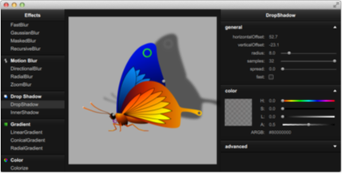
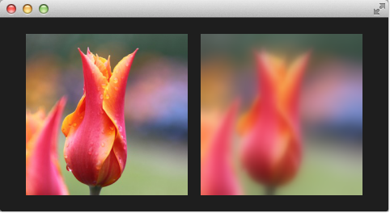

# Effect Library

The graphics effect library is a collection of shader effects. Ready-made by the Qt developers. It’s a great tool-set to be used in your application but also a great source to learn how to build shaders.

The graphics effects library comes with a so-called manual testbed which is a great tool to interactively discover the different effects.

The testbed is located under `$QTDIR/qtgraphicaleffects/tests/manual/testbed`.




The effects library contains ca 20 effects. A list of the effect and a short description can be found below.

## Graphics Effects List

* Blend
    * **`Blend`** - merges two source items by using a blend mode
* Color
    * **`BrightnessContrast`** - adjusts brightness and contrast
    * **`Colorize`** - sets color in the HSL color space  
    * **`ColorOverlay`** - applies a color layer
    * **`Desaturate`** - reduces color saturation
    * **`GammaAdjust`** - adjusts luminance
    * **`HueSaturation`** - adjusts colors in the HSL color space
    * **`LevelAdjust`** - adjusts colors in the RGB color space
* Gradient
    * **`ConicalGradient`** - draws a conical gradient
    * **`LinearGradient`** - draws a linear gradient
    * **`RadialGradient`** -draws a radial gradient
* Distortion
    * **`Displace`** - moves the pixels of the source item according to the specified displacement source
* Drop Shadow
    * **`DropShadow`** - draws a drop shadow
    * **`InnerShadow`** - draws an inner shadow
* Blur,
    * **`FastBlur`** - applies a fast blur effect
    * **`GaussianBlur`** - applies a higher quality blur effect
    * **`MaskedBlur`** - applies a varying intensity blur effect
    * **`RecursiveBlur`** - "blurs repeatedly, providing a strong blur effect"
* Motion Blur
    * **`DirectionalBlur`** - applies a directional motion blur effect
    * **`RadialBlur`** - applies a radial motion blur effect
    * **`ZoomBlur`** - applies a zoom motion blur effect
* Glow
    * **`Glow`** - draws an outer glow effect
    * **`RectangularGlow`** - draws a rectangular outer glow effect
Mask
    * **`OpacityMask`** - masks the source item with another item
    * **`ThresholdMask`** - masks the source item with another item and applies a threshold value


Here is a example using the *FastBlur* effect from the *Blur* category:

```qml
import QtQuick 2.5
import QtGraphicalEffects 1.0

Rectangle {
    width: 480; height: 240
    color: '#1e1e1e'

    Row {
        anchors.centerIn: parent
        spacing: 16

        Image {
            id: sourceImage
            source: "assets/tulips.jpg"
            width: 200; height: width
            sourceSize: Qt.size(parent.width, parent.height)
            smooth: true
        }

        FastBlur {
            width: 200; height: width
            source: sourceImage
            radius: blurred?32:0
            property bool blurred: false

            Behavior on radius {
                NumberAnimation { duration: 1000 }
            }

            MouseArea {
                id: area
                anchors.fill: parent
                onClicked: parent.blurred = !parent.blurred
            }
        }
    }
}
```

The image to the left is the original image. Clicking the image on the right will toggle blurred property and animated the blur radius from 0 to 32 during 1 second. The image on the left shows the blurred image.


