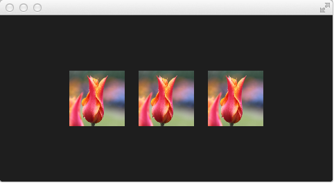

# Shader Elements

For programming shaders, Qt Quick provides two elements. The ShaderEffectSource and the ShaderEffect. The shader effect applies custom shaders and the shader effect source renders a QML item into a texture and renders it. As shader effect can apply custom shaders to its rectangular shape and can use sources for the shader operation. A source can be an image, which is used as a texture or a shader effect source.

The default shader uses the source and renders it unmodified.

```qml
import QtQuick 2.5

Rectangle {
    width: 480; height: 240
    color: '#1e1e1e'

    Row {
        anchors.centerIn: parent
        spacing: 20
        Image {
            id: sourceImage
            width: 80; height: width
            source: 'assets/tulips.jpg'
        }
        ShaderEffect {
            id: effect
            width: 80; height: width
            property variant source: sourceImage
        }
        ShaderEffect {
            id: effect2
            width: 80; height: width
            // the source where the effect shall be applied to
            property variant source: sourceImage
            // default vertex shader code
            vertexShader: "
                uniform highp mat4 qt_Matrix;
                attribute highp vec4 qt_Vertex;
                attribute highp vec2 qt_MultiTexCoord0;
                varying highp vec2 qt_TexCoord0;
                void main() {
                    qt_TexCoord0 = qt_MultiTexCoord0;
                    gl_Position = qt_Matrix * qt_Vertex;
                }"
            // default fragment shader code
            fragmentShader: "
                varying highp vec2 qt_TexCoord0;
                uniform sampler2D source;
                uniform lowp float qt_Opacity;
                void main() {
                    gl_FragColor = texture2D(source, qt_TexCoord0) * qt_Opacity;
                }"
        }
    }
}
```




In the above example, we have a row of 3 images. The first is the real image. The second is rendered using the default shader and the third is rendered using the default shader code for the fragment and vertex extracted from the Qt 5 source code.

::: tip
If you don’t want to see the source image and only the effected image you can set the *Image* to invisible (\`\` visible: false\`\`). The shader effects will still use the image data just the *Image* element will not be rendered.
:::

Let’s have a closer look at the shader code.

```qml
vertexShader: "
    uniform highp mat4 qt_Matrix;
    attribute highp vec4 qt_Vertex;
    attribute highp vec2 qt_MultiTexCoord0;
    varying highp vec2 qt_TexCoord0;
    void main() {
        qt_TexCoord0 = qt_MultiTexCoord0;
        gl_Position = qt_Matrix * qt_Vertex;
    }
"
```

Both shaders are from the Qt side a string bound to the *vertexShader* and *fragmentShader* property. Every shader code has to have a *main() { … }* function, which is executed by the GPU. Variable starting with *qt_* are provided by default by Qt already.

Here a short rundown on the variables:

* **`uniform`** - value does not change during processing
* **`attribute`** - linkage to external data
* **`varying`** - shared value between shaders
* **`highp`** - high precision value
* **`lowp`** - low precision value
* **`mat4`** - 4x4 float matrix
* **`vec2`** - 2 dim float vector
* **`sampler2D`** - 2D texture
* **`float`** - floating scalar

A better reference is the [OpenGL ES 2.0 API Quick Reference Card](http://www.khronos.org/opengles/sdk/docs/reference_cards/OpenGL-ES-2_0-Reference-card.pdf)

Now we might be better able to understand what the variable is:


* **`qt_Matrix`**: model-view-projection matrix
* **`qt_Vertex`**: current vertex position
* **`qt_MultiTexCoord0`**: texture coordinate
* **`qt_TexCoord0`**: shared texture coordinate

So we have available the projection matrix, the current vertex and the texture coordinate. The texture coordinate relates to the texture given as the source. In the *main()* function we store the texture coordinate for later use in the fragment shader. Every vertex shader needs to assign the *gl_Position* this is done using here by multiplying the project matrix with the vertex, our point in 3D.

The fragment shader receives our texture coordinate from the vertex shader and also the texture from our QML source property. It shall be noted how easy it is to pass a variable between the shader code and QML. Beautiful. Additional we have the opacity of the shader effect available as *qt_Opacity*. Every fragment shader needs to assign the *gl_FragColor* variable, this is done in the default shader code by picking the pixel from the source texture and multiplying it with the opacity.

```qml
fragmentShader: "
    varying highp vec2 qt_TexCoord0;
    uniform sampler2D source;
    uniform lowp float qt_Opacity;
    void main() {
        gl_FragColor = texture2D(source, qt_TexCoord0) * qt_Opacity;
    }
"
```

During the next examples, we will be playing around with some simple shader mechanics. First, we concentrate on the fragment shader and then we will come back to the vertex shader.

::: tip
In the example above, the shader code is written inline in a string inside the QML code. This is supported for OpenGL, but for other platforms a pre-compiled byte code version of the shader is expected. To import such a shader, simply replace the shader code with a filename referring the the pre-compiled byte code.
:::
