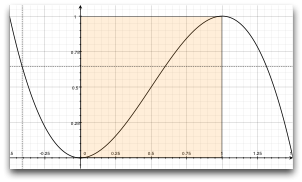
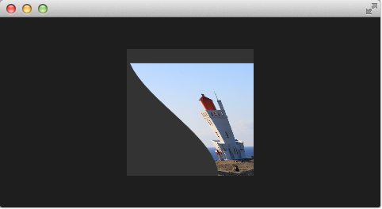

# Vertex Shader

The vertex shader can be used to manipulate the vertexes provided by the shader effect. In normal cases, the shader effect has 4 vertexes (top-left, top-right, bottom-left and bottom-right). Each vertex reported is from type vec4. To visualize the vertex shader we will program a genie effect. This effect is often used to let a rectangular window area vanish into one point.


## Setting up the scene

First, we will set up our scene again.

```qml
import QtQuick 2.5

Rectangle {
    width: 480; height: 240
    color: '#1e1e1e'

    Image {
        id: sourceImage
        width: 160; height: width
        source: "assets/lighthouse.jpg"
        visible: false
    }
    Rectangle {
        width: 160; height: width
        anchors.centerIn: parent
        color: '#333333'
    }
    ShaderEffect {
        id: genieEffect
        width: 160; height: width
        anchors.centerIn: parent
        property variant source: sourceImage
        property bool minimized: false
        MouseArea {
            anchors.fill: parent
            onClicked: genieEffect.minimized = !genieEffect.minimized
        }
    }
}
```

This provides a scene with a dark background and a shader effect using an image as the source texture. The original image is not visible on the image produced by our genie effect. Additional we added a dark rectangle on the same geometry as the shader effect so we can better detect where we need to click to revert the effect.


The effect is triggered by clicking on the image, this is defined by the mouse area covering the effect. In the *onClicked* handler we toggle the custom boolean property *minimized*. We will use this property later to toggle the effect.

## Minimize and normalize

After we have set up the scene, we define a property of type real called *minimize*, the property will contain the current value of our minimization. The value will vary from 0.0 to 1.0 and is controlled by a sequential animation.

```qml
property real minimize: 0.0

SequentialAnimation on minimize {
    id: animMinimize
    running: genieEffect.minimized
    PauseAnimation { duration: 300 }
    NumberAnimation { to: 1; duration: 700; easing.type: Easing.InOutSine }
    PauseAnimation { duration: 1000 }
}

SequentialAnimation on minimize {
    id: animNormalize
    running: !genieEffect.minimized
    NumberAnimation { to: 0; duration: 700; easing.type: Easing.InOutSine }
    PauseAnimation { duration: 1300 }
}
```

The animation is triggered by the toggling of the *minimized* property. Now that we have set up all our surroundings we finally can look at our vertex shader.

```qml
vertexShader: "
    uniform highp mat4 qt_Matrix;
    attribute highp vec4 qt_Vertex;
    attribute highp vec2 qt_MultiTexCoord0;
    varying highp vec2 qt_TexCoord0;
    uniform highp float minimize;
    uniform highp float width;
    uniform highp float height;
    void main() {
        qt_TexCoord0 = qt_MultiTexCoord0;
        highp vec4 pos = qt_Vertex;
        pos.y = mix(qt_Vertex.y, height, minimize);
        pos.x = mix(qt_Vertex.x, width, minimize);
        gl_Position = qt_Matrix * pos;
    }
"
```

The vertex shader is called for each vertex so four times, in our case. The default qt defined parameters are provided, like *qt_Matrix*, *qt_Vertex*, *qt_MultiTexCoord0*, *qt_TexCoord0*. We have discussed the variable already earlier. Additional we link the *minimize*, *width* and *height* variables from our shader effect into our vertex shader code. In the main function, we store the current texture coordinate in our *qt_TexCoord0* to make it available to the fragment shader. Now we copy the current position and modify the x and y position of the vertex:

```glsl
highp vec4 pos = qt_Vertex;
pos.y = mix(qt_Vertex.y, height, minimize);
pos.x = mix(qt_Vertex.x, width, minimize);
```

The *mix(…)* function provides a linear interpolation between the first 2 parameters on the point (0.0-1.0) provided by the 3rd parameter. So in our case, we interpolate for y between the current y position and the hight based on the current minimized value, similar for x. Bear in mind the minimized value is animated by our sequential animation and travels from 0.0 to 1.0 (or vice versa).


The resulting effect is not really the genie effect but is already a great step towards it.

## Primitive Bending

So minimized the x and y components of our vertexes. Now we would like to slightly modify the x manipulation and make it depending on the current y value. The needed changes are pretty small. The y-position is calculated as before. The interpolation of the x-position depends now on the vertexes y-position:

```glsl
highp float t = pos.y / height;
pos.x = mix(qt_Vertex.x, width, t * minimize);
```

This results in an x-position tending towards the width when the y-position is larger. In other words, the upper 2 vertexes are not affected at all as they have a y-position of 0 and the lower two vertexes x-positions both bend towards the width, so they bend towards the same x-position.


```qml
import QtQuick 2.5

Rectangle {
    width: 480; height: 240
    color: "#1e1e1e"

    Image {
        id: sourceImage
        width: 160; height: width
        source: "assets/lighthouse.jpg"
        visible: false
    }
    Rectangle {
        width: 160; height: width
        anchors.centerIn: parent
        color: "#333333"
    }
    ShaderEffect {
        id: genieEffect
        width: 160; height: width
        anchors.centerIn: parent
        property variant source: sourceImage
        property real minimize: 0.0
        property bool minimized: false


        SequentialAnimation on minimize {
            id: animMinimize
            running: genieEffect.minimized
            PauseAnimation { duration: 300 }
            NumberAnimation { to: 1; duration: 700; easing.type: Easing.InOutSine }
            PauseAnimation { duration: 1000 }
        }

        SequentialAnimation on minimize {
            id: animNormalize
            running: !genieEffect.minimized
            NumberAnimation { to: 0; duration: 700; easing.type: Easing.InOutSine }
            PauseAnimation { duration: 1300 }
        }


        vertexShader: "
            uniform highp mat4 qt_Matrix;
            uniform highp float minimize;
            uniform highp float height;
            uniform highp float width;
            attribute highp vec4 qt_Vertex;
            attribute highp vec2 qt_MultiTexCoord0;
            varying highp vec2 qt_TexCoord0;
            void main() {
                qt_TexCoord0 = qt_MultiTexCoord0;
                highp vec4 pos = qt_Vertex;
                pos.y = mix(qt_Vertex.y, height, minimize);
                highp float t = pos.y / height;
                pos.x = mix(qt_Vertex.x, width, t * minimize);
                gl_Position = qt_Matrix * pos;
            }
        "
        MouseArea {
            anchors.fill: parent
            onClicked: parent.minimized = !parent.minimized
        }
    }
}
```

## Better Bending

As the bending is not really satisfying currently we will add several parts to improve the situation.
First, we enhance our animation to support an own bending property. This is necessary as the bending should happen immediately and the y-minimization should be delayed shortly. Both animations have in the sum the same duration (300+700+1000 and 700+1300).

```qml
property real bend: 0.0
property bool minimized: false


// change to parallel animation
ParallelAnimation {
    id: animMinimize
    running: genieEffect.minimized
    SequentialAnimation {
        PauseAnimation { duration: 300 }
        NumberAnimation {
            target: genieEffect; property: 'minimize';
            to: 1; duration: 700;
            easing.type: Easing.InOutSine
        }
        PauseAnimation { duration: 1000 }
    }
    // adding bend animation
    SequentialAnimation {
        NumberAnimation {
            target: genieEffect; property: 'bend'
            to: 1; duration: 700;
            easing.type: Easing.InOutSine }
        PauseAnimation { duration: 1300 }
    }
}
```

Additional to make the bending a smooth curve the y-effect on the x-position is not modified by a curved function from 0..1 and the `pos.x` depends now on the new bend property animation:

```glsl
highp float t = pos.y / height;
t = (3.0 - 2.0 * t) * t * t;
pos.x = mix(qt_Vertex.x, width, t * bend);
```

The curve starts smooth at the 0.0 value, grows then and stops smoothly towards the 1.0 value. Here is a plot of the function in the specified range. For us, only the range from 0..1 is from interest.




The most visual change is by increasing our amount of vertex points. The vertex points used can be increased by using a mesh:

```qml
mesh: GridMesh { resolution: Qt.size(16, 16) }
```

The shader effect now has an equality distributed grid of 16x16 vertexes instead of the 2x2 vertexes used before. This makes the interpolation between the vertexes look much smoother.




You can see also the influence of the curve being used, as the bending smoothes at the end nicely. This is where the bending has the strongest effect.

## Choosing Sides

As a final enhancement, we want to be able to switch sides. The side is towards which point the genie effect vanishes. Till now it vanishes always towards the width. By adding a *side* property we are able to modify the point between 0 and width.

```qml
ShaderEffect {
    ...
    property real side: 0.5

    vertexShader: "
        ...
        uniform highp float side;
        ...
        pos.x = mix(qt_Vertex.x, side * width, t * bend);
    "
}
```


## Packaging

The last thing to-do is packaging our effect nicely. For this, we extract our genie effect code into an own component called *GenieEffect*. It has the shader effect as the root element. We removed the mouse area as this should not be inside the component as the triggering of the effect can be toggled by the *minimized* property.

```qml
import QtQuick 2.5

ShaderEffect {
    id: genieEffect
    width: 160; height: width
    anchors.centerIn: parent
    property variant source
    mesh: GridMesh { resolution: Qt.size(10, 10) }
    property real minimize: 0.0
    property real bend: 0.0
    property bool minimized: false
    property real side: 1.0


    ParallelAnimation {
        id: animMinimize
        running: genieEffect.minimized
        SequentialAnimation {
            PauseAnimation { duration: 300 }
            NumberAnimation {
                target: genieEffect; property: 'minimize';
                to: 1; duration: 700;
                easing.type: Easing.InOutSine
            }
            PauseAnimation { duration: 1000 }
        }
        SequentialAnimation {
            NumberAnimation {
                target: genieEffect; property: 'bend'
                to: 1; duration: 700;
                easing.type: Easing.InOutSine }
            PauseAnimation { duration: 1300 }
        }
    }

    ParallelAnimation {
        id: animNormalize
        running: !genieEffect.minimized
        SequentialAnimation {
            NumberAnimation {
                target: genieEffect; property: 'minimize';
                to: 0; duration: 700;
                easing.type: Easing.InOutSine
            }
            PauseAnimation { duration: 1300 }
        }
        SequentialAnimation {
            PauseAnimation { duration: 300 }
            NumberAnimation {
                target: genieEffect; property: 'bend'
                to: 0; duration: 700;
                easing.type: Easing.InOutSine }
            PauseAnimation { duration: 1000 }
        }
    }

    vertexShader: "
        uniform highp mat4 qt_Matrix;
        attribute highp vec4 qt_Vertex;
        attribute highp vec2 qt_MultiTexCoord0;
        uniform highp float height;
        uniform highp float width;
        uniform highp float minimize;
        uniform highp float bend;
        uniform highp float side;
        varying highp vec2 qt_TexCoord0;
        void main() {
            qt_TexCoord0 = qt_MultiTexCoord0;
            highp vec4 pos = qt_Vertex;
            pos.y = mix(qt_Vertex.y, height, minimize);
            highp float t = pos.y / height;
            t = (3.0 - 2.0 * t) * t * t;
            pos.x = mix(qt_Vertex.x, side * width, t * bend);
            gl_Position = qt_Matrix * pos;
        }
    "
}
```

You can use now the effect simply like this:

```qml
import QtQuick 2.5

Rectangle {
    width: 480; height: 240
    color: '#1e1e1e'

    GenieEffect {
        source: Image { source: 'assets/lighthouse.jpg' }
        MouseArea {
            anchors.fill: parent
            onClicked: parent.minimized = !parent.minimized
        }
    }
}
```

We have simplified the code by removing our background rectangle and we assigned the image directly to the effect, instead of loading it inside a standalone image element.

