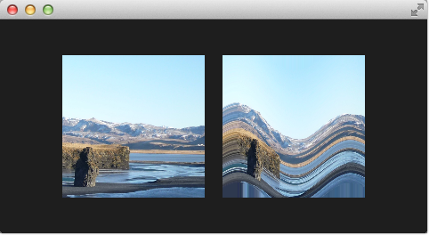

# Wave Effect

In this more complex example, we will create a wave effect with the fragment shader. The waveform is based on the sinus curve and it influences the texture coordinates used for the color.

```qml
import QtQuick 2.5

Rectangle {
    width: 480; height: 240
    color: '#1e1e1e'

    Row {
        anchors.centerIn: parent
        spacing: 20
        Image {
            id: sourceImage
            width: 160; height: width
            source: "assets/coastline.jpg"
        }
        ShaderEffect {
            width: 160; height: width
            property variant source: sourceImage
            property real frequency: 8
            property real amplitude: 0.1
            property real time: 0.0
            NumberAnimation on time {
                from: 0; to: Math.PI*2; duration: 1000; loops: Animation.Infinite
            }

            fragmentShader: "
                varying highp vec2 qt_TexCoord0;
                uniform sampler2D source;
                uniform lowp float qt_Opacity;
                uniform highp float frequency;
                uniform highp float amplitude;
                uniform highp float time;
                void main() {
                    highp vec2 pulse = sin(time - frequency * qt_TexCoord0);
                    highp vec2 coord = qt_TexCoord0 + amplitude * vec2(pulse.x, -pulse.x);
                    gl_FragColor = texture2D(source, coord) * qt_Opacity;
                }
            "
        }
    }
}
```

The wave calculation is based on a pulse and the texture coordinate manipulation. The pulse equation gives us a sine wave depending on the current time and the used texture coordinate:

```glsl
highp vec2 pulse = sin(time - frequency * qt_TexCoord0);
```

Without the time factor, we would just have a distortion but not a traveling distortion like waves are.

For the color we use the color at a different texture coordinate:

```glsl
highp vec2 coord = qt_TexCoord0 + amplitude * vec2(pulse.x, -pulse.x);
```

The texture coordinate is influenced by our pulse x-value. The result of this is a moving wave.




Also if we haven’t moved pixels in this fragment shader the effect would look at first like a job for a vertex shader.

