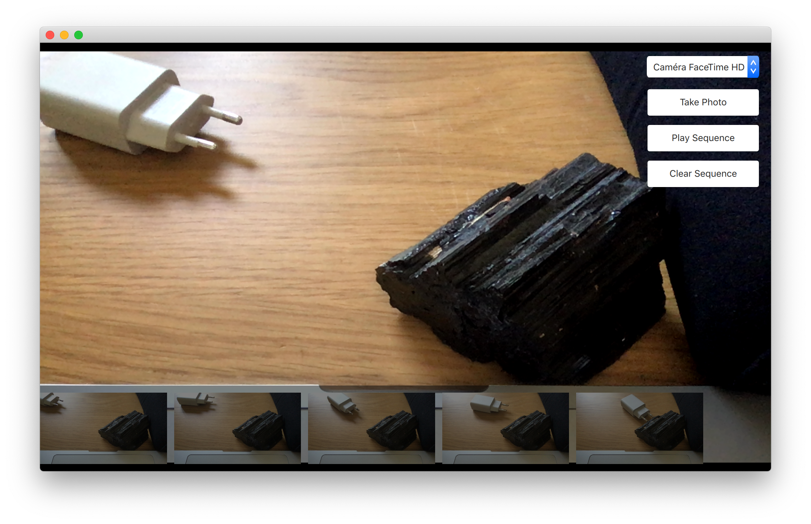

# Capturing Images

One of the key features of the `Camera` element is that is can be used to take pictures. We will use this in a simple stop-motion application. In it, you will learn how to show a viewfinder, snap photos and keep track of the pictures taken.

The user interface is shown below. It consists of three major parts. In the background, you will find the viewfinder, to the right, a column of buttons and at the bottom, a list of images taken. The idea is to take a series of photos, then click the Play Sequence button. This will play the images back, creating a simple stop-motion film.




The viewfinder part of the camera is simply a `Camera` element used as `source` in a `VideoOutput`. This will show the user a live video stream from the camera.

```qml
VideoOutput {
    anchors.fill: parent
    source: camera
}

Camera {
    id: camera
}
```

::: tip
For more control over the camera behaviour, for instance to control exposure or focus settings, use the `exposure` and `focus` properties of the `Camera` object. These expose a whole range of settings made available through the [CameraExposure](http://doc.qt.io/qt-5/qml-qtmultimedia-cameraexposure.html) and [CameraFocus](http://doc.qt.io/qt-5/qml-qtmultimedia-camerafocus.html) elements.
:::

The list of photos is a `ListView` oriented horizontally shows images from a `ListModel` called `imagePaths`. In the background, a semi-transparent black `Rectangle` is used.

```qml
ListModel {
    id: imagePaths
}

ListView {
    id: listView

    anchors.left: parent.left
    anchors.right: parent.right
    anchors.bottom: parent.bottom
    anchors.bottomMargin: 10

    height: 100

    orientation: ListView.Horizontal
    spacing: 10

    model: imagePaths

    delegate: Image {
        height: 100
        source: path
        fillMode: Image.PreserveAspectFit
    }

    Rectangle {
        anchors.fill: parent
        anchors.topMargin: -10

        color: "black"
        opacity: 0.5
    }
}
```

For the shooting of images, you need to know that the `Camera` element contains a set of sub-elements for various tasks. To capture still pictures, the `Camera.imageCapture` element is used. When you call the `capture` method, a picture is taken. This results in the `Camera.imageCapture` emitting first the `imageCaptured` signal followed by the `imageSaved` signal.

```qml
Button {
    id: shotButton

    text: "Take Photo"
    onClicked: {
        camera.imageCapture.capture();
    }
}
```

To intercept the signals of a sub-element, a `Connections` element is needed. In this case, we don’t need to show a preview image, but simply add the resulting image to the `ListView` at the bottom of the screen. Shown in the example below, the path to the saved image is provided as the `path` argument with the signal.

```qml
Connections {
    target: camera.imageCapture

    onImageSaved: {
        imagePaths.append({"path": path})
        listView.positionViewAtEnd();
    }
}
```

For showing a preview, connect to the `imageCaptured` signal and use the `preview` signal argument as `source` of an `Image` element. A `requestId` signal argument  is sent along both the `imageCaptured` and `imageSaved`. This value is returned from the `capture` method. Using this, the capture of an image can be traced through the complete cycle. This way, the preview can be used first and then be replaced by the properly saved image. This, however, is nothing that we do in the example.

The last part of the application is the actual playback. This is driven using a `Timer` element and some JavaScript. The `_imageIndex` variable is used to keep track of the currently shown image. When the last image has been shown, the playback is stopped. In the example, the `root.state` is used to hide parts of the user interface when playing the sequence.

```qml
property int _imageIndex: -1

function startPlayback()
{
    root.state = "playing";
    setImageIndex(0);
    playTimer.start();
}

function setImageIndex(i)
{
    _imageIndex = i;

    if (_imageIndex >= 0 && _imageIndex < imagePaths.count)
        image.source = imagePaths.get(_imageIndex).path;
    else
        image.source = "";
}

Timer {
    id: playTimer

    interval: 200
    repeat: false

    onTriggered: {
        if (_imageIndex + 1 < imagePaths.count)
        {
            setImageIndex(_imageIndex + 1);
            playTimer.start();
        }
        else
        {
            setImageIndex(-1);
            root.state = "";
        }
    }
}
```

