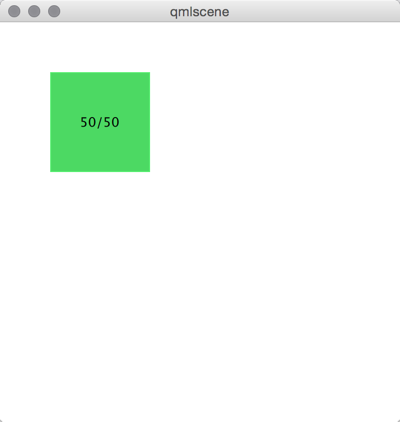

# Local Storage - SQL

Qt Quick supports a local storage API known from the web browsers the local storage API. the API is available under “import QtQuick.LocalStorage 2.0”.

In general, it stores the content into an SQLite database in a system-specific location in a unique ID based file based on the given database name and version. It is not possible to list or delete existing databases. You can find the storage location from `QQmlEngine::offlineStoragePath()`.

You use the API by first creating a database object and then creating transactions on the database. Each transaction can contain one or more SQL queries. The transaction will roll-back when a SQL query will fail inside the transaction.

For example, to read from a simple notes table with a text column you could use the local storage like this:

```qml
import QtQuick 2.5
import QtQuick.LocalStorage 2.0

Item {
    Component.onCompleted: {
        var db = LocalStorage.openDatabaseSync("MyExample", "1.0", "Example database", 10000);
        db.transaction( function(tx) {
            var result = tx.executeSql('select * from notes');
            for(var i = 0; i < result.rows.length; i++) {
                    print(result.rows[i].text);
                }
            }
        });
    }
}
```

## Crazy Rectangle

As an example assume we would like to store the position of a rectangle on our scene.




Here our base example.

```qml
import QtQuick 2.5

Item {
    width: 400
    height: 400

    Rectangle {
        id: crazy
        objectName: 'crazy'
        width: 100
        height: 100
        x: 50
        y: 50
        color: "#53d769"
        border.color: Qt.lighter(color, 1.1)
        Text {
            anchors.centerIn: parent
            text: Math.round(parent.x) + '/' + Math.round(parent.y)
        }
        MouseArea {
            anchors.fill: parent
            drag.target: parent
        }
    }
}
```

You can drag the rectangle freely around. When you close the application and launch it again the rectangle is at the same position.

Now we would like to add that the x/y position of the rectangle is stored inside the SQL DB. For this, we need to add an `init`, `read` and `store` database function. These functions are called when on component completed and on component destruction.

```qml
import QtQuick 2.5
import QtQuick.LocalStorage 2.0

Item {
    // reference to the database object
    property var db;

    function initDatabase() {
        // initialize the database object
    }

    function storeData() {
        // stores data to DB
    }

    function readData() {
        // reads and applies data from DB
    }


    Component.onCompleted: {
        initDatabase();
        readData();
    }

    Component.onDestruction: {
        storeData();
    }
}
```

You could also extract the DB code in an own JS library, which does all the logic. This would be the preferred way if the logic gets more complicated.

In the database initialization function, we create the DB object and ensure the SQL table is created.

```qml
function initDatabase() {
    print('initDatabase()')
    db = LocalStorage.openDatabaseSync("CrazyBox", "1.0", "A box who remembers its position", 100000);
    db.transaction( function(tx) {
        print('... create table')
        tx.executeSql('CREATE TABLE IF NOT EXISTS data(name TEXT, value TEXT)');
    });
}
```

The application next calls the read function to read existing data back from the database. Here we need to differentiate if there is already data in the table. To check we look into how many rows the select clause has returned.

```js
function readData() {
    print('readData()')
    if(!db) { return; }
    db.transaction( function(tx) {
        print('... read crazy object')
        var result = tx.executeSql('select * from data where name="crazy"');
        if(result.rows.length === 1) {
            print('... update crazy geometry')
            // get the value column
            var value = result.rows[0].value;
            // convert to JS object
            var obj = JSON.parse(value)
            // apply to object
            crazy.x = obj.x;
            crazy.y = obj.y;
        }
    });
}
```

We expect the data is stored in a JSON string inside the value column. This is not typical SQL like, but works nicely with JS code. So instead of storing the x,y as properties in the table, we store them as a complete JS object using the JSON stringify/parse methods. In the end, we get a valid JS object with x and y properties, which we can apply on our crazy rectangle.

To store the data, we need to differentiate the update and insert cases. We use update when a record already exists and insert if no record under the name “crazy” exists.

```js
function storeData() {
    print('storeData()')
    if(!db) { return; }
    db.transaction( function(tx) {
        print('... check if a crazy object exists')
        var result = tx.executeSql('SELECT * from data where name = "crazy"');
        // prepare object to be stored as JSON
        var obj = { x: crazy.x, y: crazy.y };
        if(result.rows.length === 1) {// use update
            print('... crazy exists, update it')
            result = tx.executeSql('UPDATE data set value=? where name="crazy"', [JSON.stringify(obj)]);
        } else { // use insert
            print('... crazy does not exists, create it')
            result = tx.executeSql('INSERT INTO data VALUES (?,?)', ['crazy', JSON.stringify(obj)]);
        }
    });
}
```

Instead of selecting the whole recordset we could also use the SQLite count function like this: `SELECT COUNT(\*) from data where name = "crazy"` which would return use one row with the number of rows affected by the select query. Otherwise, this is common SQL code. As an additional feature, we use the SQL value binding using the `?` in the query.

Now you can drag the rectangle and when you quit the application the database stores the x/y position and applies it on the next application run.

