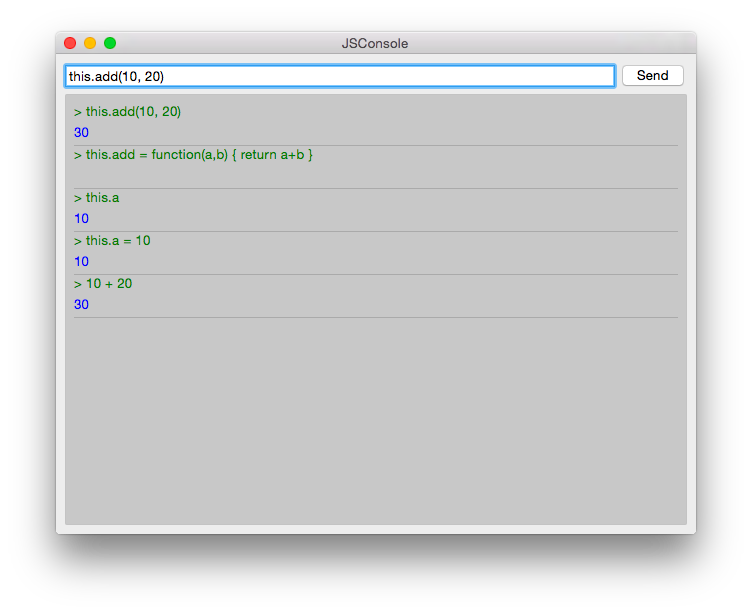

# Creating a JS Console

As a little example, we will create a JS console. We need an input field where the user can enter his JS expressions and ideally there should be a list of output results. As this should more look like a desktop application we use the QtQuick Controls module.

::: tip
A JS console inside your next project can be really beneficial for testing. Enhanced with a Quake-Terminal effect it is also good to impress customers. To use it wisely you need to control the scope the JS console evaluates in, e.g. the currently visible screen, the main data model, a singleton core object or all together.
:::




We use Qt Creator to create a Qt Quick UI project using QtQuick controls. We call the project JSConsole. After the wizard has finished we have already a basic structure for the application with an application window and a menu to exit the application.

For the input, we use a TextField and a Button to send the input for evaluation. The result of the expression evaluation is displayed using a ListView with a ListModel as the model and two labels to display the expression and the evaluated result.

```qml
// part of JSConsole.qml
ApplicationWindow {
  id: root

  ...

  ColumnLayout {
      anchors.fill: parent
      anchors.margins: 9
      RowLayout {
          Layout.fillWidth: true
          TextField {
              id: input
              Layout.fillWidth: true
              focus: true
              onAccepted: {
                  // call our evaluation function on root
                  root.jsCall(input.text)
              }
          }
          Button {
              text: qsTr("Send")
              onClicked: {
                  // call our evaluation function on root
                  root.jsCall(input.text)
              }
          }
      }
      Item {
          Layout.fillWidth: true
          Layout.fillHeight: true
          Rectangle {
              anchors.fill: parent
              color: '#333'
              border.color: Qt.darker(color)
              opacity: 0.2
              radius: 2
          }

          ScrollView {
              id: scrollView
              anchors.fill: parent
              anchors.margins: 9
              ListView {
                  id: resultView
                  model: ListModel {
                      id: outputModel
                  }
                  delegate: ColumnLayout {
                      width: ListView.view.width
                      Label {
                          Layout.fillWidth: true
                          color: 'green'
                          text: "> " + model.expression
                      }
                      Label {
                          Layout.fillWidth: true
                          color: 'blue'
                          text: "" + model.result
                      }
                      Rectangle {
                          height: 1
                          Layout.fillWidth: true
                          color: '#333'
                          opacity: 0.2
                      }
                  }
              }
          }
      }
  }
}
```

The evaluation function `jsCall` does the evaluation not by itself this has been moved to a JS module (`jsconsole.js`) for clearer separation.

```qml
// part of JSConsole.qml

import "jsconsole.js" as Util

...

ApplicationWindow {
  id: root

  ...

  function jsCall(exp) {
      var data = Util.call(exp);
      // insert the result at the beginning of the list
      outputModel.insert(0, data)
  }
}
```

For safety, we do not use the `eval` function from JS as this would allow the user to modify the local scope. We use the Function constructor to create a JS function on runtime and pass in our scope as this variable. As the function is created every time it does not act as a closure and stores its own scope, we need to use `this.a = 10` to store the value inside this scope of the function. This scope is set by the script to the scope variable.

```js
// jsconsole.js
.pragma library

var scope = {
  // our custom scope injected into our function evaluation
}

function call(msg) {
    var exp = msg.toString();
    console.log(exp)
    var data = {
        expression : msg
    }
    try {
        var fun = new Function('return (' + exp + ');');
        data.result = JSON.stringify(fun.call(scope), null, 2)
        console.log('scope: ' + JSON.stringify(scope, null, 2) + 'result: ' + result)
    } catch(e) {
        console.log(e.toString())
        data.error = e.toString();
    }
    return data;
}
```

The data return from the call function is a JS object with a result, expression and error property: `data: { expression: {}, result: {}, error: {} }`. We can use this JS object directly inside the ListModel and access it then from the delegate, e.g. `model.expression` gives us the input expression. For the simplicity of the example, we ignore the error result.
